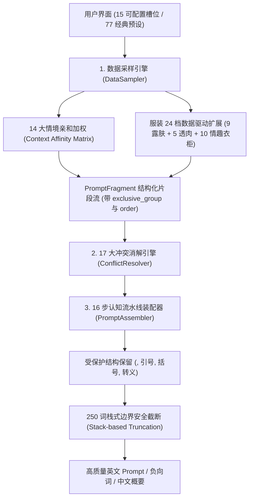

# ComfyUI-IYKYK

<p align="center">
  
  
  
  
  
  
</p>

**ComfyUI-IYKYK** (If You Know You Know) 是专为 ComfyUI 打造的专业级东亚人像写真与成人美学提示词生成、情境亲和加权与物理冲突消解套件。

> 📌 **项目溯源与致谢 (Origin & Acknowledgement)**  
> 本项目核心架构与词库规范基于开源项目 [ShuaiHui/nsfw-prompt-templates-asian](https://github.com/ShuaiHui/nsfw-prompt-templates-asian) 深度重构。我们将其定义的 **16 步视觉认知流水线**、**17 大物理与语义冲突消解引擎**、**14 大核心情境亲和矩阵**、**77 套经典预设模板**、**28 大服装品类 × 6 级裸露解构** 与 **24 档高级扩展库** 完整封装为纯原生、零外部依赖的高性能 ComfyUI 自定义节点套件。

> 🤖 **开发与审查声明 (Architecture & Development Statement)**  
> 本项目的代码架构、数据清洗与结构化建模、17 大冲突消解引擎、14 大情境矩阵、Draft-7 深度递归强门禁、24 档数据驱动扩展策略与发布自动化测试套件由人类开发者与 AI (Google DeepMind Antigravity / Gemini / GPT-5.6 Sol) 协同开发与架构审查完成。

---

## 🌟 核心架构与技术特性



---

### 1. 🎴 严谨的流水线槽位口径体系
本项目在工程上明确区分三层槽位概念，杜绝概念混淆：
- **15 用户可配置控件**：场景大类、剧情主题、景别构图、拍摄视角、裸露等级、服装款式与状态、发型发色、饰品头饰、妆容细节、姿势动作、情绪表情、光影预设、胶片风格、液体效果、纹身标记、道具物件、角色设定、真实微瑕、画质等级。
- **16 步视觉认知装配流水线**：按扩散模型注意力机制层层递进（`场景空间` → `景别视角` → `角色设定` → `裸露状态` → `服装穿脱` → `光影氛围` → `姿势动作` → `表情眼神` → `妆容细节` → `发型饰品` → `微瑕质感` → `纹身标记` → `道具环境` → `液体系统` → `胶片影调` → `画质锚点`）。
- **18 项内部调度槽位 (`SLOT_PIPELINE_ORDER`)**：底层通过 `PromptFragment` 数据结构承载 18 个细分装配槽位与空间互斥组（`exclusive_group`）。

---

### 2. 🛡️ 17 大物理与语义自洽冲突消解引擎

插件内置基于 `PromptFragment` 结构化管道的 17 规则冲突消解引擎，在生成前自动修复各种 AI 绘图典型物理与视觉崩图矛盾：

| 规则编号 | 规则名称 | 冲突消解原理与保护机制 |
| :--- | :--- | :--- |
| **Rule 1** | **空间环境自洽互斥** (`spatial_environmental_mutual_exclusion`) | 全部 122 个场景子分类绑定 `exclusive_group`，按输入顺序锁定首个主场景，杜绝「温泉与餐厅并存」、「室内温泉与露天雪景并存」等跨空间矛盾。 |
| **Rule 2** | **裸露与内衣状态互斥** (`nudity_clothing_conflicts`) | 严格划分 L1～L6 裸露等级：私处暴露时自动剔除内裤，全裸（L5/L6）时自动剔除穿着描述并将衣物转换为散落背景。 |
| **Rule 3** | **材质穿透伪影消解** (`material_penetration`) | 自动拦截 `sheer/see-through` 等易崩词，替换为真实物理脱法（如解纽扣、滑落、湿身紧贴）。 |
| **Rule 4** | **视线与镜头角度几何对齐** (`gaze_angle_geometry`) | 仰拍（低角度）强制俯视下看镜头，俯拍（高角度）强制仰视上看镜头，POV 视角强制直视镜头。 |
| **Rule 5** | **视线方向唯一性** (`gaze_mutual_exclusion`) | 消解「直视镜头」与「移开视线/看向他处」之间的方向互斥。 |
| **Rule 6** | **液体微量与安全法则** (`liquid_restrictions`) | 自动添加微量量词（如 `faint trace of`, `thin streak of`），杜绝眼部液体引发白内障畸形。 |
| **Rule 7** | **设备与画质兼容性** (`device_quality_compatibility`) | 监控（CCTV）/手机自拍模式下自动过滤 8K、单反、摄影写真等高保真冲突词。 |
| **Rule 8** | **纹身真皮层融合** (`tattoo_fusion`) | 严格作用于纹身槽位，自动注入 6 词真皮层融合描述，杜绝 `pink`/`drink`/`link` 等子串误触发。 |
| **Rule 9** | **姿势手部占用与道具互斥** (`pose_hand_occupation`) | 双手抱头、双手被绑、双手撑地等占用姿势下，自动剔除手持手机/相机/扇子/酒杯等动作，根除多手伪影。 |
| **Rule 10** | **情绪表情与眼神方向一致** (`emotion_gaze_affinity`) | 消解害羞与直视对视、冷淡与挑逗眨眼等割裂人设。 |
| **Rule 11** | **环境光照与黑夜白昼自洽** (`environmental_lighting_coherence`) | 场景主锚点优先：夜景场所与深夜天气下自动过滤日光/阳光透过窗户等日间光照词条。 |
| **Rule 12** | **妆容与细节自洽** (`makeup_details_coherence`) | 素颜无妆状态下自动剔除睫毛膏融化、口红涂抹晕开等糊妆词。 |
| **Rule 13** | **景别特写与下肢足部自洽** (`framing_lower_body_coherence`) | 头部/面部极致特写时自动剔除高跟鞋、大腿袜、吊袜带、足部描述，防止构图注意力割裂与背景畸形肢体。 |
| **Rule 14** | **饰品遮挡与视线动作自洽** (`accessory_occlusion_gaze_coherence`) | 蒙眼布/遮眼/闭眼状态下自动剔除直视镜头、眨眼等动作，消除布条上强行画眼睛的视觉伪影。 |
| **Rule 15** | **黑白胶片与高饱和色彩互斥** (`monochrome_film_chroma_coherence`) | 黑白/单色胶片下消解彩虹/高饱和 RGB 霓虹色彩，保留纯正明暗与影调反差。 |
| **Rule 16** | **服装款式与解构状态互斥** (`clothing_style_state_coherence`) | 连体泳衣/死库水禁止解纽扣/掀裙；牛仔裤/长裤禁止裙开衩与裙摆飘动。 |
| **Rule 17** | **多手持道具唯一性消解** (`handheld_props_single_holder`) | 同时出现多个手持动作时仅保留首个主手持动作，彻底消除 AI 生成 3 只手以上的畸形。 |

---

### 3. 🧠 14 大核心情境亲和度矩阵 (Context Affinity Matrix)

当各槽位设为 `随机 (Random)` 时，插件根据场景主题自动识别核心情境，并在专属情境词库中执行加权采样（14 大情境矩阵全槽位 ID 100% 精确交叉复核）：

| 情境分类 (Context) | 典型适用场景 | 自动亲和槽位联动特性 (Clothing / Char / Makeup / Props / etc.) |
| :--- | :--- | :--- |
| 🏫 **`school` (校园)** | 教室、图书室、体育馆、保健室 | 水手服/西装校服、女学生/教师、清纯伪素颜、双马尾/黑长直、黑框眼镜、手机录像 |
| 💼 **`office` (职场)** | 办公室、会议室、茶水间、电梯 | OL西装套裙/针织衫、女下属/女上司、轻熟妆/烟熏、低马尾/大波浪、红酒杯、工作牌 |
| 🏥 **`medical` (医疗)** | 医院病房、诊所、体检室 | 护士服、温柔护士、清纯素颜、护士帽、听诊器、微汗水珠 |
| ♨️ **`onsen_bath` (温泉)** | 露天风吕、温泉旅馆、钱汤浴室 | 浴衣/和服/死库水、人妻/邻家女友、微醺潮红/水光妆、湿发贴脸、沐浴水滴 |
| ⛓️ **`bondage_sm` (SM调教)** | 监禁密室、地下室、废弃建筑 | 乳胶紧身衣/皮革束腰、调教女仆/女上司、崩溃哭妆/受虐妆、项圈手铐/红绳、耻骨淫纹 |
| ⛩️ **`traditional` (和风传统)** | 和室、神社寺庙、日式茶室 | 和服/振袖/旗袍/汉服、极道和彫龙/樱花纹身、和风折扇/油纸伞、古典盘发 |
| 🚇 **`transit` (公共交通)** | 电车车厢、地铁站台、新干线、机舱 | JK制服/OL西装/随性常服、清纯妆/微红、马尾辫、随身手机、金细锁骨链 |
| 🏖️ **`outdoor` (户外自然)** | 沙滩泳池、森林步道、深夜公园、天台 | 微型比基尼/高叉泳衣/啦啦队服、阳光亲吻妆/水光、高马尾/丸子头、三脚架闪光灯 |
| 🍜 **`dining` (餐饮娱乐)** | 居酒屋包厢、女仆咖啡厅、拉面店、屋台 | 女仆装/服务生制服/改良旗袍、甜美蜜桃妆、包包头/短发波波头、女仆发箍、酒杯 |
| 🍸 **`nightlife` (夜店夜生活)** | 夜店酒吧、歌舞伎町、兔女郎俱乐部 | 兔女郎装/夜店紧身包臀裙、歌舞伎町陪酒女、魅惑烟熏妆/高潮潮红、兔耳/身体链、香槟 |
| 🛋️ **`domestic` (居家私密)** | 卧室私密、豪华套房、一户建、试衣间 | 丝绸睡袍/吊带睡裙/露背毛衣、少妇人妻、纯欲白桃妆、散乱床头卷发、床头小猫/抱枕 |
| 💋 **`adult` (成人制作)** | 泡泡浴店、AV摄影棚、魔镜号、试镜间 | 蕾丝情趣内衣/高叉连体服、AV女优/风俗娘、高潮面红/脱妆、眼罩/情趣项圈、体液水光 |
| 🧪 **`special` (特殊密室)** | 透明空间、配电管道、镜面密室 | 紧身皮衣/乳胶衣、冷淡高傲/受虐妆、姬发切/黑长直、皮质束颈项圈、条形码烙印 |
| ☕ **`generic` (日常随拍)** | 街头巷角、便利店、自动贩卖机旁 | 街头随性卫衣/牛仔短裤、邻家女友、自然裸妆、黑长直/低马尾、随身手机 |

---

### 4. 👗 服装 28 大类 × 6 级裸露解构 × 24 档数据驱动扩展库

```
clothing.json (单一事实来源)
├── categories: 28 大经典服装分类 (旗袍, 汉服, 和服, JK, OL, 护士, 女仆, 兔女郎, 乳胶衣等)
├── clothing_states: 12 大穿脱解构状态 (解纽扣, 吊带滑落, 裙摆掀起, 湿身透光, 仅剩内衣等)
├── clothing_nudity_linkage: L1～L6 裸露等级精准脱法咬合
└── extension_policy (数据驱动采样，24/24 扩展逐 ID 100% 可达):
    ├── sfw_exposure_tiers (9 档露肤): 领口镂空 → 露肩 → 乳沟浅露 → 高开衩 → 腰部镂空 → 露腰露腹 → 大面积镂空 → 大露背 → 侧缝全开
    ├── cloth_transparency_tiers (5 档透度): 薄纱微透 → 半透朦胧 → 逆光透影 → 通透显影 → 极致透薄
    └── lingerie_wardrobe (10 类情趣衣柜): 薄透透视 → 蕾丝镂空 → 三点式 → 连体连袜 → 开裆免脱 → 吊袜袜装 → 束身束缚 → 制服角色 → 国风旗袍 → 皮装乳胶
```

- **纯净与安全隔离**：L1（包裹）、L5（全裸）、L6（特写）在 1000 随机种子测试下扩展命中数为 0（零污染）；L2/L3/L4 严格按策略受控扩展。

---

### 5. 🛡️ 标准 Draft-7 递归校验强门禁与发布隔离

- **真·Draft-7 深度递归校验**：覆盖全量 19 个运行时数据文件的 JSON Schema 定义（包含 `pattern`, `enum`, `minItems`, `maxItems`, `uniqueItems`, `required`, `properties`）。
- **零源码泄漏的发布沙箱构建**：`scripts/build_release.py` 在独立沙箱执行 `python3 -I` 隔离测试，确保发布 ZIP 包仅包含 33 个必要运行时文件，校验和确定性可复现。
- **Span 级受保护语法字节保留**：`<lora:model:0.8>`, `"quoted phrase"`, `(masterpiece:1.2)`, `[tag1:tag2:10]`, `escaped\,comma` 经装配流水线 100% 原样保留，配合栈式嵌套校验器严防语法破损。

---

## 🎛️ 节点套件说明

### 1. 🎴 IYKYK 15槽位提示词生成器 (`IYKYKPromptGenerator`)
全维度的 15 槽位精准控制，每个槽位均可独立选择「无」、「随机」或指定具体项目。

**输出端口**：
- `正面提示词 (STRING)`: 经过 16 步装配、17 大冲突消解、受保护语法保留及 250 词安全截断后的英文正面提示词。
- `负面提示词 (STRING)`: 高质量通用清洗防崩负面提示词。
- `中文场景描述 (STRING)`: 当前画面配置的中文概要说明。

---

### 2. 📋 IYKYK 模板浏览器 (`IYKYKPresetBrowser`)
一键浏览与调用 **77 套完整手写经典场景模板**（涵盖温泉旅馆、教室后排、深夜电车、秘密办公室等），并支持叠加 **8 大导演风格配方** 与自定义随机扰动。

---

### 3. 🧩 IYKYK 自定义槽位拼装器 (`IYKYKCustomSlotCombiner`)
支持自由文本输入或多节点连接各槽位文本，底层统一执行 17 大冲突消解引擎与画质强化装配流水线。

---

## 🚀 安装方法

### 方法 1：Git Clone（推荐）
进入 ComfyUI 的 `custom_nodes` 目录并克隆本仓库：

```bash
cd /path/to/ComfyUI/custom_nodes
git clone https://github.com/imymi/ComfyUI-IYKYK.git
```

### 方法 2：ComfyUI Manager 安装
在 ComfyUI Manager 中搜索 `ComfyUI-IYKYK` 并点击 Install。

### 方法 3：手动下载发布包
从 [Releases](https://github.com/imymi/ComfyUI-IYKYK/releases) 下载最新的 `ComfyUI-IYKYK-v1.1.0-rc6.zip`，解压至 `ComfyUI/custom_nodes/ComfyUI-IYKYK`。

重启 ComfyUI 后，在节点右键菜单中即可找到 **`IYKYK / 提示词生成`**。

---

## 🧪 质量验证与自动化测试

本项目拥有严密的自动化测试套件与持续集成门禁，覆盖全量核心逻辑：

```bash
# 执行全量 88 项单元测试与 Draft-7 递归校验
python3 scripts/validate_data.py --strict
python3 -m unittest discover -s tests -v
```

```text
----------------------------------------------------------------------
Ran 88 tests in ~50s
OK
```

- ✅ `test_context_affinity_matrix.py`: 14 大情境直通映射与全槽位 ID 100% 存在性验证
- ✅ `test_conflict_engine_matrix.py`: 17 大冲突规则与 15 槽位级联矩阵测试
- ✅ `test_catalog_rule_reachability.py`: 规则 catalog terms 100% 精确覆盖与端到端消解
- ✅ `test_props_and_extensions_reachability.py`: 24/24 扩展逐 ID 100% 可达与 L1/L5/L6 零污染
- ✅ `test_schema_negatives.py`: 14 项 Draft-7 负向变异与严格拦截测试
- ✅ `test_finalize_boundaries.py`: 受保护语法 Span 级保留与栈式括号嵌套测试
- ✅ `test_nudity_levels.py`: 28 服装 × 6 裸露等级全矩阵脱法测试
- ✅ `test_release_build.py`: 确定性发布构建与真隔离沙箱烟测

---

## 📄 鸣谢与开源协议

- **词库与理论溯源**：基于 [ShuaiHui/nsfw-prompt-templates-asian](https://github.com/ShuaiHui/nsfw-prompt-templates-asian) 深度开发。
- **协议**：本项目基于 [Apache-2.0 License](LICENSE) 开源。
- ⚠️ **免责声明**：本项目仅供技术交流与艺术创作用途，使用者须遵守所在国家/地区的法律法规，**未满 18 岁禁止使用**。
