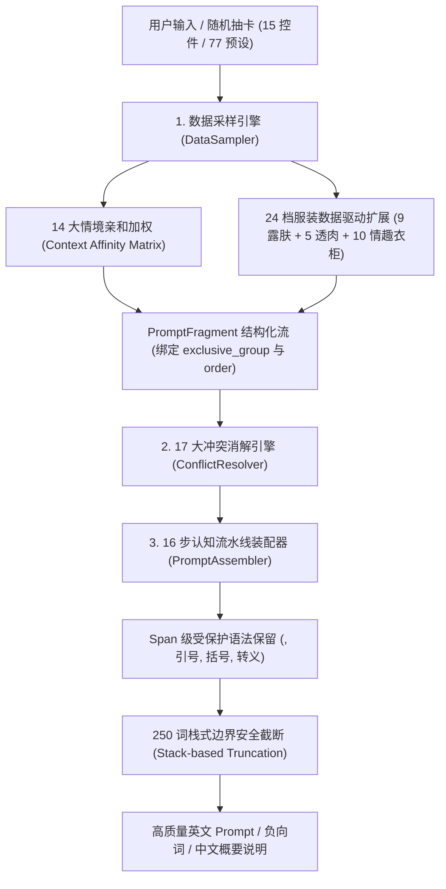

# ComfyUI-IYKYK

<p align="center">
  
  
  
  
  
  
</p>

<p align="center">
  <strong>专为 ComfyUI 打造的专业级东亚人像写真与成人美学提示词生成系统</strong><br>
  <em>16 步视觉认知流水线 · 17 大多规则物理与语义冲突消解 · 14 大核心情境亲和加权 · 28 服装 × 6 裸露解构 × 24 档扩展库</em>
</p>

---

## 📑 目录导航

- [📖 项目简介与溯源](#-项目简介与溯源)
- [🌟 核心架构与流水线](#-核心架构与流水线)
- [🛡️ 17 大多规则物理与语义冲突消解引擎](#️-17-大多规则物理与语义冲突消解引擎)
- [🧠 14 大核心情境亲和度矩阵](#-14-大核心情境亲和度矩阵)
- [👗 服装解构体系与 24 档扩展库](#-服装解构体系与-24-档扩展库)
- [🎛️ 节点套件说明与参数详解](#️-节点套件说明与参数详解)
- [🚀 详细安装指南](#-详细安装指南)
- [🧪 工程规范与质量门禁](#-工程规范与质量门禁)
- [❓ 常见问题 (FAQ)](#-常见问题-faq)
- [📄 开源协议与免责声明](#-开源协议与免责声明)

---

## 📖 项目简介与溯源

在文生图（Stable Diffusion / SDXL / FLUX）人像写真与剧情场景创作中，传统随机抽卡与简单提示词堆叠极易产生大量严重的视觉与物理逻辑缺陷：
- **场景割裂**：同时出现“露天雪景温泉”与“餐厅室内包厢”等相互矛盾的独立空间；
- **肢体与伪影异常**：双手抱头/双手撑地姿势下仍强行手持手机、相机、扇子，导致 AI 生成 3 只手以上的畸形；
- **材质假死与崩图**：`sheer`/`see-through` 等词汇引发材质穿透伪影，导致衣物与皮肤融化变形；
- **构图脱节**：面部大特写时提示词中充斥高跟鞋、大腿袜、脚踝描述，导致背景生成异物；
- **穿脱逻辑自相矛盾**：全裸或私处暴露状态下依然残留内裤或外套穿着描述。

**ComfyUI-IYKYK** (If You Know You Know) 通过纯原生、零外部依赖的高性能 Python 架构，从根本上消解这些痛点。

> 📌 **开源项目溯源与致谢**  
> 本项目核心架构与词库规范基于开源项目 [ShuaiHui/nsfw-prompt-templates-asian](https://github.com/ShuaiHui/nsfw-prompt-templates-asian) 深度重构。我们将其定义的 **16 步视觉认知流水线**、**17 大物理与语义冲突消解引擎**、**14 大核心情境亲和矩阵**、**77 套经典手写预设模板**、**28 大服装品类 × 6 级裸露解构** 与 **24 档高级扩展库** 完整封装为 ComfyUI 原生节点套件。

> 🤖 **开发与审查声明**  
> 本项目的代码架构、数据建模、冲突消解算法、情境亲和加权、Draft-7 深度递归强门禁、24 档数据驱动扩展策略与发布自动化测试套件由人类开发者与 AI (Google DeepMind Antigravity / Gemini / GPT-5.6 Sol) 协同开发与架构审查完成。

---

## 🌟 核心架构与流水线

### 全链路处理流程图



---

### 🎴 三层槽位口径体系

为了向用户与开发者提供精准的工程概念，本项目在架构上严格明确三层槽位定义：

1. **15 用户可配置控件**：
   `场景大类`、`剧情主题`、`景别构图`、`拍摄视角`、`裸露等级`、`服装款式与状态`、`发型发色`、`饰品头饰`、`妆容细节`、`姿势动作`、`情绪表情`、`光影预设`、`胶片风格`、`液体效果`、`纹身标记`、`道具物件`、`角色设定`、`真实微瑕`、`画质等级`。
2. **16 步视觉认知装配流水线**：
   严格遵循扩散模型自粗至细、自外至内的注意力机制层层递进：
   `场景空间` → `景别视角` → `角色设定` → `裸露状态` → `服装穿脱` → `光影氛围` → `姿势动作` → `表情眼神` → `妆容细节` → `发型饰品` → `微瑕质感` → `纹身标记` → `道具环境` → `液体系统` → `胶片影调` → `画质锚点`。
3. **18 核心 + 2 辅助调度槽位 (`SLOT_ORDER`, `AUXILIARY_SLOT_ORDER`)**：
   底层通过 `PromptFragment` 数据结构承载 18 个细分核心装配槽位与 2 个辅助槽位（`style_recipe`, `custom`），严格保证 `custom` 处于流水线最末尾消费。

---

## 🛡️ 17 大多规则物理与语义冲突消解引擎

插件内置基于 `PromptFragment` 结构化管道的 17 大规则冲突消解引擎，在生成前自动分析并修复提示词内部的各种物理与视觉崩图矛盾：

| 规则编号 | 规则标识 | 消解原理与保护机制 |
| :--- | :--- | :--- |
| **Rule 1** | **空间环境自洽互斥**<br>`spatial_environmental_mutual_exclusion` | 全部 122 个场景子分类绑定唯一 `exclusive_group`，按片段顺序锁定首个主场景，杜绝“温泉与餐厅并存”、“室内温泉与露天雪景并存”等跨空间矛盾。 |
| **Rule 2** | **裸露与内衣状态互斥**<br>`nudity_clothing_conflicts` | 严格划分 L1～L6 裸露等级：私处暴露时自动剔除内裤，全裸（L5/L6）时自动剔除穿着描述并将衣物转换为散落背景描述。 |
| **Rule 3** | **材质穿透伪影消解**<br>`material_penetration` | 自动拦截服装易崩图词条（如 `sheer`, `see-through`），智能替换为真实物理脱法（如解纽扣、滑落、湿身紧贴），严格限定服装作用域，杜绝误杀妆容、光照与场景词条。 |
| **Rule 4** | **视线与镜头角度几何对齐**<br>`gaze_angle_geometry` | 仰拍（低角度）强制俯视下看镜头，俯拍（高角度）强制仰视上看镜头，POV 视角强制直视镜头。 |
| **Rule 5** | **视线方向唯一性**<br>`gaze_mutual_exclusion` | 消解“直视镜头（direct eye contact）”与“移开视线/看向他处（looking away）”之间的方向互斥。 |
| **Rule 6** | **液体微量与安全法则**<br>`liquid_restrictions` | 自动添加微量修饰词（如 `faint trace of`, `thin streak of`），杜绝眼部液体引发白内障畸形。 |
| **Rule 7** | **设备与画质兼容性**<br>`device_quality_compatibility` | 监控（CCTV）/手机自拍模式下自动过滤 8K、单反、摄影写真等高保真冲突词。 |
| **Rule 8** | **纹身真皮层融合**<br>`tattoo_dermal_fusion` | 严格作用于纹身槽位，自动注入 6 词真皮层融合描述，杜绝 `pink`/`drink`/`link` 等子串误触发。 |
| **Rule 9** | **姿势手部占用与道具互斥**<br>`pose_hand_occupation` | 双手抱头、双手被绑、双手撑地等占用姿势下，自动剔除手持手机/相机/扇子/酒杯等动作，根除多手伪影。 |
| **Rule 10** | **情绪表情与眼神方向一致**<br>`emotion_gaze_affinity` | 消解害羞与直视对视、冷淡与挑逗眨眼等割裂人设。 |
| **Rule 11** | **环境光照与黑夜白昼自洽**<br>`environmental_lighting_coherence` | 场景主锚点优先：夜景场所与深夜天气下自动过滤日光/阳光透过窗户等日间光照词条。 |
| **Rule 12** | **妆容与细节自洽**<br>`makeup_details_coherence` | 素颜无妆状态下自动剔除睫毛膏融化、口红涂抹晕开等糊妆词。 |
| **Rule 13** | **景别特写与下肢足部自洽**<br>`framing_lower_body_coherence` | 头部/面部极致特写时自动剔除高跟鞋、大腿袜、吊袜带、足部描述，防止构图注意力割裂与背景畸形肢体。 |
| **Rule 14** | **饰品遮挡与视线动作自洽**<br>`accessory_occlusion_gaze_coherence` | 蒙眼布/遮眼/闭眼状态下自动剔除直视镜头、眨眼等动作，消除布条上强行画眼睛的视觉伪影。 |
| **Rule 15** | **黑白胶片与高饱和色彩互斥**<br>`monochrome_film_chroma_coherence` | 黑白/单色胶片下消解彩虹/高饱和 RGB 霓虹色彩，保留纯正明暗与影调反差。 |
| **Rule 16** | **服装款式与解构状态互斥**<br>`clothing_style_state_coherence` | 连体泳衣/死库水禁止解纽扣/掀裙；牛仔裤/长裤禁止裙开衩与裙摆飘动。 |
| **Rule 17** | **多手持道具唯一性消解**<br>`handheld_props_single_holder` | 同时出现多个手持动作时仅保留首个主手持动作，彻底消除 AI 生成 3 只手以上的畸形。 |

---

## 🧠 14 大核心情境亲和度矩阵

当槽位设为 `随机 (Random)` 时，插件不会进行盲目随机，而是自动根据场景与主题推断核心情境，并在专属词库中执行加权采样。矩阵中涉及的所有槽位 ID 均经过自动化交叉复核验证，确保 **100% 精确存在**：

| 情境分类 (Context) | 典型适用场景 | 自动亲和槽位联动特性 (Clothing / Char / Makeup / Props / etc.) |
| :--- | :--- | :--- |
| 🏫 **`school` (校园)** | 教室、图书室、体育馆、保健室 | 水手服/西装校服、女学生/教师、清纯伪素颜、双马尾/黑长直、黑框眼镜、手机录像 |
| 💼 **`office` (职场)** | 办公室、会议室、茶水间、电梯 | OL西装套裙/针织衫、女下属/女上司、轻熟妆/烟熏、低马尾/大波浪、红酒杯、工作牌 |
| 🏥 **`medical` (医疗)** | 医院病房、诊所、体检室 | 护士服、温柔护士、清纯素颜、护士帽、听诊器、微汗水珠 |
| ♨️ **`onsen_bath` (温泉浴室)** | 露天风吕、温泉旅馆、钱汤浴室 | 浴衣/和服/死库水、人妻/邻家女友、微醺潮红/水光妆、湿发贴脸、沐浴水滴 |
| ⛓️ **`bondage_sm` (SM调教)** | 监禁密室、地下室、废弃建筑 | 乳胶紧身衣/皮革束腰、调教女仆/女上司、崩溃哭妆/受虐妆、项圈手铐/红绳、耻骨淫纹 |
| ⛩️ **`traditional` (和风传统)** | 和室、神社寺庙、日式茶室 | 和服/振袖/旗袍/汉服、极道和彫龙/樱花纹身、和风折扇/油纸伞、古典盘发 |
| 🚇 **`transit` (公共交通)** | 电车车厢、地铁站台、新干线、机舱 | JK制服/OL西装/随性常服、清纯妆/微红、马尾辫、随身手机、金细锁骨链 |
| 🏖️ **`outdoor` (户外自然)** | 沙滩泳池、森林步道、深夜公园、天台 | 微型比基尼/高叉泳衣/啦啦队服、阳光亲吻妆/水光、高马尾/丸子头、三脚架闪光灯 |
| 🍜 **`dining` (餐饮娱乐)** | 居酒屋包厢、女仆咖啡厅、拉面店、屋台 | 女仆装/服务生制服/改良旗袍、甜美蜜桃妆、包包头/短发波波头、女仆发箍、酒杯 |
| 🍸 **`nightlife` (夜店夜生活)** | 夜店酒吧、歌舞伎町、兔女郎俱乐部 | 兔女郎装/夜店紧身包臀裙、歌舞伎町陪酒女、魅惑烟熏妆/高潮潮红、兔耳/身体链、香槟 |
| 🛋️ **`domestic` (居家私密)** | 卧室私密、豪华套房、一户建、试衣间 | 丝绸睡袍/吊带睡裙/露背毛衣、少妇人妻、纯欲白桃妆、散乱床头卷发、床头小猫/抱枕 |
| 💋 **`adult` (成人制作)** | 泡泡浴店、AV摄影棚、魔镜号、试镜间 | 蕾丝情趣内衣/高叉连体服、AV女优/风俗娘、高潮面红/脱妆、眼罩/情趣项圈、体液水光 |
| 🧪 **`special` (特殊密室)** | 透明空间、配电管道、镜面密室 | 紧身皮衣/乳胶衣、冷淡高傲/受虐妆、姬发切/黑长直、皮质束颈项圈、条形码烙印 |
| ☕ **`generic` (日常随拍)** | 街头巷角、便利店、自动贩卖机旁 | 街头随性卫衣/牛仔短裤、邻家女友、自然裸妆、黑长直/低马尾、随身手机 |

---

## 👗 服装解构体系与 24 档扩展库

### 1. 28 大经典服装分类与 12 种解构状态
- **28 经典品类**：旗袍、汉服、改良国风、和服、浴衣、振袖、水手服、西装校服、体育服/死库水、韩服、韩系校服、职场OL西装、护士服、女仆装、餐厅服务员、蕾丝情趣内衣、丝绸睡袍、吊带睡裙、微型比基尼、高叉连体泳衣、乳胶紧身衣、皮革束腰、兔女郎装、啦啦队服、露背晚礼服、街头随性常服、夜店紧身裙、童贞杀露背毛衣。
- **12 穿脱解构状态**：自动联动、整齐穿着、解开纽扣、吊带滑落、裙摆掀起、内衣拉下、湿身透光、汗湿透光、撕裂破损、衣衫凌乱、仅剩内衣、脱掉散落一旁。

### 2. 24 档数据驱动扩展库 (`extension_policy`)
在 `clothing.json` 中以单一事实来源（SSOT）统一定义策略，实现 **24/24 扩展逐 ID 100% 稳定可达**：

```
clothing.json
├── sfw_exposure_tiers (9 档露肤):
│   ├── 领口镂空 (轻度)
│   ├── 露肩 (轻中度)
│   ├── 乳沟浅露 (中度)
│   ├── 高开衩露腿 (中度)
│   ├── 腰部镂空 (重度)
│   ├── 露腰露腹 (重度)
│   ├── 大面积镂空 (极重)
│   ├── 极致大露背 (极重)
│   └── 侧缝全开 (极限)
│
├── cloth_transparency_tiers (5 档透度):
│   ├── 薄纱微透 (轻度)
│   ├── 半透朦胧 (轻中度)
│   ├── 逆光透影 (中度)
│   ├── 通透显影 (重度)
│   └── 极致透薄 (极重)
│
└── lingerie_wardrobe (10 类情趣衣柜):
    ├── 薄透透视
    ├── 蕾丝镂空
    ├── 三点式
    ├── 连体连袜 (Bodystocking)
    ├── 开裆免脱 (Crotchless)
    ├── 吊袜袜装 (Garter belt)
    ├── 束身束缚 (Corset cincher)
    ├── 制服角色 (Cosplay)
    ├── 国风旗袍 (Oriental cheongsam)
    └── 皮装乳胶 (Leather/Latex)
```

- **零污染安全隔离**：L1（包裹）、L5（全裸）、L6（特写全见）在 1000 随机种子测试下扩展命中数为 0（绝不混入无关扩展词）；L2/L3/L4 严格按 `extension_policy` 策略采样。

---

## 🎛️ 节点套件说明与参数详解

### 1. 🎴 IYKYK 15槽位提示词生成器 (`IYKYKPromptGenerator`)
全维度的 15 槽位精准控制生成器。

| 端口/参数 | 类型 | 说明 |
| :--- | :--- | :--- |
| `预设模板` / `风格配方` | 下拉菜单 | 77 套经典手写预设模板与风格配方选择（指定预设时优先装配） |
| `场景大类` / `剧情主题` | 下拉菜单 | 场景大类（24 细分类别）与剧情主题风格（支持指定或随机） |
| `景别构图` / `拍摄视角` | 下拉菜单 | 景别构图与拍摄视角 |
| `裸露等级` | 下拉菜单 | 6 级裸露控制（L1 包裹暗示 → L6 特写全见） |
| `服装款式` / `服装状态` | 下拉菜单 | 服装款式与穿脱解构状态（支持自动联动裸露等级） |
| `发型发色` / `饰品头饰` | 下拉菜单 | 发型发色与头饰首饰 |
| `妆容细节` / `姿势动作` / `情绪表情` | 下拉菜单 | 妆容细节、姿势动作与情绪表情 |
| `光影预设` / `胶片风格` | 下拉菜单 | 专业摄影光影预设与胶片质感 |
| `液体效果` / `纹身标记` | 下拉菜单 | 液体水珠系统与真皮层融合纹身标记 |
| `道具物件` / `角色设定` | 下拉菜单 | 场景互动道具与人物角色卡 |
| `真实微瑕` / `画质等级` | 下拉菜单 | 真实皮肤微瑕质感与画质等级 |
| `prompt_seed` | 整数控件 | **-1 为动态随机抽卡**；**>=0 为确定性复现种子** |
| **输出: 正面提示词 (STRING)** | 输出 | 经装配、消解与安全截断的高质量英文 Prompt |
| **输出: 负面提示词 (STRING)** | 输出 | 通用清洗防崩负面词 |
| **输出: 中文场景描述 (STRING)** | 输出 | 当前画面配置的中文概要说明 |

> 💡 **自定义词条输入说明**：如需叠加输入外部自定义提示词（含 LoRA、权重语法与额外 Tag），请使用套件内的 **`IYKYKCustomSlotCombiner`**（🧩 IYKYK 自定义槽位拼装器节点），其提供专用的 **`自定义追加`** 端口并在底层严格接入末尾消费的 `custom` 辅助槽位。

---

### 2. 📋 IYKYK 模板浏览器 (`IYKYKPresetBrowser`)
一键浏览与调用 **77 套完整手写经典场景模板**（涵盖温泉旅馆、教室后排、深夜电车、秘密办公室等），并支持叠加 **8 大导演风格配方** 与自定义随机扰动。

---

### 3. 🧩 IYKYK 自定义槽位拼装器 (`IYKYKCustomSlotCombiner`)
支持多节点连线或自由输入各槽位文本（提供专用的 **`自定义追加`** 输入端口），底层统一执行 17 大冲突消解与 16 步画质强化装配流水线。

---

## 🚀 详细安装指南

> [!IMPORTANT]
> **分发与运行方式说明**：本项目为 ComfyUI 原生自定义节点套件，标准安装与运行方式为通过 ComfyUI Manager、Git Clone 或解压 Release ZIP 至 `ComfyUI/custom_nodes/` 目录。`pyproject.toml` 仅用于开发依赖环境管理 (`pip install -e ".[dev]"`) 与代码静态治理（Ruff, Pytest, Schema 生成），项目不以 pip wheel/sdist 形式对外分发运行。

### 方法 1：ComfyUI Manager 安装（通过 Git URL）

1. 打开 ComfyUI 界面，点击右下角的 **`Manager`** 按钮；
2. 在管理器菜单中点击 **`Install via Git URL`**（通过 Git URL 安装）；
3. 在弹出的输入框中粘贴本仓库地址：
   ```text
   https://github.com/imymi/ComfyUI-IYKYK.git
   ```
4. 点击 **`OK`**，等待 Manager 自动下载并完成安装；
5. 在弹出的提示中点击 **`Restart`** 重启 ComfyUI 即可。

---

### 方法 2：Git Clone（终端命令行推荐）

进入 ComfyUI 的 `custom_nodes` 目录并克隆本仓库：

```bash
cd /path/to/ComfyUI/custom_nodes
git clone https://github.com/imymi/ComfyUI-IYKYK.git
```

---

### 方法 3：手动下载发布包

1. 前往 GitHub [Releases](https://github.com/imymi/ComfyUI-IYKYK/releases) 页面下载最新的发布包 `ComfyUI-IYKYK-v1.1.0-rc7.zip`；
2. 解压到 `ComfyUI/custom_nodes/ComfyUI-IYKYK` 目录下；
3. 重启 ComfyUI。

重启后，在 ComfyUI 画布空白处双击或右键，搜索 **`IYKYK`** 即可调出节点。

---

## 🧪 工程规范与质量门禁

本项目建立了极其严格的工程质量门禁与持续集成验证：

```bash
# 0. 执行 Schema 契约防漂移只读比对 (0 写盘、0 漂移)
python3 scripts/generate_rule_schemas.py --check

# 1. 执行 Draft-7 递归 Schema 强门禁校验
python3 scripts/validate_data.py --strict

# 2. 执行全仓库代码规范 Ruff 校验
ruff check .

# 3. 执行全量自动化单元测试与集成测试
python3 -m unittest discover -s tests -v

# 4. 独立沙箱方案 A 不可变构建与确定性发布包检验 (38 个运行时文件)
python3 scripts/build_release.py --mode verify
```

```text
----------------------------------------------------------------------
Ran tests in ~230s
OK
```

- ✅ `test_selection_contracts.py`: 22+1 槽位四态契约、全 UI 选项 1:1 精确映射、All-None 纯净度、服装状态真实联动与全链路 Provenance 断言
- ✅ `test_lexer_and_spans.py`: PromptAtom 全链路流转、六大 Span 权限矩阵、嵌套黑盒受控保护与合法转义逗号 `escaped\,` 字节级保留
- ✅ `test_conflict_engine_ssot.py`: 17 条规则单一契约 SSOT、L1～L6 逐级强制存在、黑盒后代括号整块免删、Fail-Closed 与 match_mode 精确匹配
- ✅ `test_slot_pipeline_integrity.py`: 18 槽位契约单向依赖、全槽位别名单数规范化、Tag 级保序去重与 Resolver 实例复用
- ✅ `test_schema_negatives.py`: 两阶段全局 Alias 防冲突与 15 项 Draft-7 负向变异拦截测试
- ✅ `test_context_affinity_matrix.py`: 14 大情境直通映射与全槽位 ID 100% 存在性验证
- ✅ `test_catalog_rule_reachability.py`: 规则 catalog terms 100% 精确覆盖与端到端消解
- ✅ `test_props_and_extensions_reachability.py`: 24/24 扩展逐 ID 100% 可达与 L1/L5/L6 零污染
- ✅ `test_finalize_boundaries.py`: 250 词唯一硬边界与嵌套栈式语法校验
- ✅ `test_nudity_levels.py`: 28 服装 × 6 裸露等级全矩阵脱法与 L1 零暴露
- ✅ `test_release_build.py`: 方案 A 不可变版本目录、原子指针 CURRENT.json、多步故障注入保护旧 generation 逐字节不变、Schema 只读检查与并发隔离构建

---

## ❓ 常见问题 (FAQ)

### Q1: 在 ComfyUI Manager 搜索栏中直接搜不到 `ComfyUI-IYKYK` 怎么办？
**A**: 由于本项目为新发布仓库，尚未被官方中心索引库自动收录。请使用 Manager 的 **`Install via Git URL`** 功能，粘贴 `https://github.com/imymi/ComfyUI-IYKYK.git` 即可一秒安装。

### Q2: 自定义输入中的 LoRA 语法 `<lora:name:0.8>` 会被冲突消解引擎破坏吗？
**A**: **绝对不会**。底层已实现 Span 级受保护语法解析机制，所有形如 `<lora:...>`, `(weight:1.2)`, `[tag1:tag2:10]`, `"quoted string"`, `escaped\,comma` 的结构在装配与截断过程中均享受 100% 字节级不可变保护。

### Q3: 如何固定某一次随机生成的提示词？
**A**: 将 `prompt_seed` 从 `-1` 改为当前生成使用的具体数字（或右键固定 seed），节点将启用 ComfyUI 缓存机制，实现 100% 确定性复现。

---

## 📄 开源协议与免责声明

- **词库与理论溯源**：基于 [ShuaiHui/nsfw-prompt-templates-asian](https://github.com/ShuaiHui/nsfw-prompt-templates-asian) 深度开发。
- **协议**：本项目基于 [Apache-2.0 License](LICENSE) 开源。
- ⚠️ **免责声明**：本项目仅供技术交流与艺术创作用途，使用者须遵守所在国家/地区的法律法规，**未满 18 岁禁止使用**。
