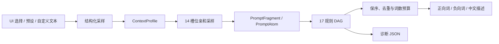

# ComfyUI-IYKYK

[](https://github.com/imymi/ComfyUI-IYKYK/releases)
[](https://github.com/imymi/ComfyUI-IYKYK/actions/workflows/ci.yml)


ComfyUI-IYKYK 是一套面向东亚人像与剧情场景的提示词生成节点。它把场景、人物、服装、构图、光线等选择组织成结构化语义，再通过冲突规则生成更自洽的正向提示词、负向提示词和中文说明。

当前版本：**v1.1.0-rc8**。本版本新增多信号情境亲和矩阵、17 规则 DAG 冲突引擎和可重放的诊断 JSON。

> 本项目包含仅适合成年人的 SFW/NSFW 词库。请先阅读[内容与授权](#内容与授权)。

## 主要能力

- 四个 ComfyUI 原生节点：完整生成、预设浏览、自定义拼装和提示词诊断。
- 77 个预设、8 个风格配方、14 类情境和 20 份运行时数据目录。
- Random/Auto 使用情境亲和采样；显式选择保持优先，但仍接受物理与语义冲突检查。
- 17 条稳定规则按阶段、优先级和依赖 DAG 执行，不依赖文档编号或隐式代码顺序。
- 固定 `prompt_seed` 可在 rc8 内确定性复现；不同版本之间不承诺提示词逐字一致。
- LoRA、加权括号、引号和转义逗号等受保护 Span 保持字节不变。
- 诊断节点输出可按 Draft-7 Schema 验证的确定性 JSON，记录选择来源、规则决策和 Atom 生命周期。
- 最终提示词按完整 Tag 控制在 250 词以内，不截断受保护语法。

## 安装

### Release ZIP（推荐）

1. 从 [GitHub Releases](https://github.com/imymi/ComfyUI-IYKYK/releases) 下载 `ComfyUI-IYKYK-v1.1.0-rc8.zip`。
2. 解压到 `ComfyUI/custom_nodes/ComfyUI-IYKYK`。
3. 重启 ComfyUI，在节点搜索中输入 `IYKYK`。

### Git

```bash
cd /path/to/ComfyUI/custom_nodes
git clone https://github.com/imymi/ComfyUI-IYKYK.git
```

如果需要固定到当前候选版本：

```bash
cd ComfyUI-IYKYK
git checkout v1.1.0-rc8
```

### ComfyUI Manager

在 Manager 中选择 **Install via Git URL**，输入：

```text
https://github.com/imymi/ComfyUI-IYKYK.git
```

安装完成后重启 ComfyUI。本项目作为自定义节点运行，不通过 PyPI wheel 或 sdist 分发。

## 快速开始

1. 添加 `IYKYKPromptGenerator`。
2. 保持默认值运行一次，获得正向提示词、负向提示词和中文场景描述。
3. 把正向与负向字符串连接到工作流中的文本编码节点。
4. 想复现结果时，把 `prompt_seed` 从 `-1` 改为固定整数。
5. 想查看某个词为何被删除、替换或注入时，换用相同输入的 `IYKYKPromptDiagnostics`。

选择模式的含义：

| 模式 | 行为 |
| --- | --- |
| Random | 从合法候选中采样；对 14 个受治理槽位应用情境亲和分布 |
| Auto | 根据已经选出的场景、主题或关联槽位推断 |
| None | 跳过该槽位 |
| 显式选项 | 保留用户选择，不被亲和矩阵覆盖；如构成硬冲突，仍由规则引擎消解 |

## 节点

| 节点 | 用途 | 输出 |
| --- | --- | --- |
| `IYKYKPromptGenerator` | 使用完整控制面板生成提示词 | 正向、负向、中文描述 |
| `IYKYKPresetBrowser` | 浏览 77 个预设并叠加风格与画质 | 正向、负向、中文描述 |
| `IYKYKCustomSlotCombiner` | 把自由文本按语义槽位拼装后统一消解 | 正向、负向、已拼装槽位数 |
| `IYKYKPromptDiagnostics` | 复用完整生成器输入并输出审计轨迹 | 正向、负向、中文描述、审计 JSON |

### 完整生成器输入

`IYKYKPromptGenerator` 和 `IYKYKPromptDiagnostics` 共享同一组输入：

| 分组 | 端口 |
| --- | --- |
| 模板与上下文 | `预设模板`、`风格配方`、`场景大类`、`剧情主题` |
| 镜头 | `景别构图`、`拍摄视角` |
| 人物与服装 | `裸露等级`、`服装款式`、`服装状态`、`发型发色`、`饰品头饰`、`妆容细节`、`角色设定` |
| 动作与效果 | `姿势动作`、`情绪表情`、`液体效果`、`纹身标记`、`道具物件`、`真实微瑕` |
| 成像 | `光影预设`、`胶片风格`、`画质等级` |
| 自定义文本 | `自定义提示词`：可选多行输入，追加到正向提示词；留空保持原有行为 |
| 随机性 | `prompt_seed`；`-1` 每次变化，非负整数用于复现 |

### 预设浏览器输入

`IYKYKPresetBrowser` 接收 `预设模板`、`风格配方`、`画质等级`、`prompt_seed` 和可选多行 `自定义提示词`。固定 seed 时，预设、配方与冲突消解结果都可复现。

`自定义提示词` 支持普通 Tag、LoRA 和加权语法，与生成内容一起参与冲突消解、去重和 250 词预算。普通 Tag 用逗号分隔；受保护语法保持字节不变。诊断节点会记录自定义内容的来源及过滤结果。

### 自定义拼装器输入

`IYKYKCustomSlotCombiner` 提供 `场景主题`、`景别视角`、`裸露状态`、`服装款式`、`光影氛围`、`姿势动作`、`表情眼神`、`风格胶片`、`妆容发型`、`微瑕细节`、`纹身标记`、`道具物件`、`角色体液`、`画质修饰` 和 `自定义追加`。

`自定义追加` 适合放置 LoRA、权重表达式或需要原样保留的额外 Tag。受保护语法会保持字节不变；如果硬冲突只存在于无法修改的受保护内容中，解析器会 Fail-Closed，而不是静默输出矛盾结果。

## 工作原理



底层装配使用 `SLOT_ORDER` 的 18 个核心槽位和 `AUXILIARY_SLOT_ORDER` 的 2 个辅助槽位。结构化目录项优先使用语义事实；自由文本只在自定义入口使用预编译 fallback 模式。

### 情境亲和矩阵

场景信号权重为 `1.0`，实际采样主题信号权重为 `0.6`，合并后归一化；无信号时使用 `generic=1.0`。Random/Auto 槽位的最终分布为：

```text
P = 0.15 × 全局合法分布 + 0.85 × Σ(情境权重 × 情境候选分布)
```

14 类情境为：`school`、`office`、`medical`、`onsen_bath`、`bondage_sm`、`traditional`、`transit`、`outdoor`、`dining`、`nightlife`、`domestic`、`adult`、`special`、`generic`。

亲和度覆盖的 14 个槽位为：`clothing`、`character`、`makeup`、`hairstyle`、`jewelry`、`props`、`tattoo`、`liquids`、`pose`、`expression`、`lighting`、`film`、`shot_type`、`camera_angle`。

矩阵定义在 [`data/context_affinity.json`](data/context_affinity.json)，Schema 位于 [`schemas/context-affinity.schema.json`](schemas/context-affinity.schema.json)。

### 冲突规则

规则 ID 是公开且稳定的标识；表格顺序只是按执行阶段展示。

| 阶段 | 稳定规则 ID |
| --- | --- |
| anchors | `spatial_environmental_mutual_exclusion`、`nudity_clothing_conflicts`、`framing_lower_body_coherence` |
| physical | `pose_hand_occupation`、`handheld_props_single_holder`、`clothing_style_state_coherence`、`material_penetration`、`device_quality_compatibility`、`environmental_lighting_coherence`、`monochrome_film_chroma_coherence`、`makeup_details_coherence` |
| semantic | `gaze_angle_geometry`、`accessory_occlusion_gaze_coherence`、`emotion_gaze_affinity`、`gaze_mutual_exclusion` |
| effects | `liquid_restrictions`、`tattoo_dermal_fusion` |

每次删除、替换或注入都会写入 `ResolutionDecision`。规则完成后会重新检测不变量；对相同 Atom 再次消解必须保持幂等且不新增决策。规则契约与 fallback 模式位于 [`data/conflict_rules.json`](data/conflict_rules.json)。

## 诊断 JSON

`IYKYKPromptDiagnostics` 只采样和消解一次。固定 seed 与相同输入下，它的前三个输出和 `IYKYKPromptGenerator` 逐字节一致。

JSON 顶层固定包含：

```text
schema_version
effective_seed
context_profile
selections
decisions
rules_applied
unresolved_conflicts
counts
```

其中：

- `selections` 记录原始选择、来源模式、source/produced/accepted Atom、去重和预算过滤。
- `decisions` 记录规则、阶段、动作、原因、胜者、目标和替换产生物。
- `unresolved_conflicts` 正常应为空；受保护内容导致的不可解硬冲突不会被隐藏。
- `counts` 满足 Atom 生命周期守恒关系。

序列化采用 UTF-8、排序键和紧凑分隔符，不写入时间戳、临时路径、内存地址或随机 UUID。Schema 位于 [`schemas/diagnostics.schema.json`](schemas/diagnostics.schema.json)。

## 确定性与兼容性

- `prompt_seed >= 0`：同一 rc8 版本、相同输入得到相同输出与诊断 JSON。
- `prompt_seed = -1`：按 ComfyUI 的生成周期更新结果。
- rc7 与 rc8 的同 seed 输出允许变化；rc8 改用了独立 RNG 子流和 DAG 规则调度。
- 既有三个节点的输出数量与类型保持不变；rc8 只新增了诊断节点。
- 输出是普通字符串，可接入常见 ComfyUI 文本编码流程；最终模型效果仍取决于 checkpoint、文本编码器、采样参数和工作流。

## 开发与验证

开发依赖只用于测试、Schema 校验和构建：

```bash
python -m venv .venv
source .venv/bin/activate
python -m pip install -e ".[dev]"
```

运行主要门禁：

```bash
ruff check .
python scripts/generate_rule_schemas.py --check
python scripts/validate_data.py --strict
python -m unittest discover -s tests -q
python scripts/build_release.py --mode verify
```

rc8 发布审核记录包括：

- Python 3.9、3.10、3.11、3.12 各 321 项测试通过。
- 20 个运行时 JSON 严格校验通过，规则 Schema 零漂移。
- 10,000 组全链随机生成具备确定性、零残余硬冲突和二次消解幂等性。
- 77 × 9 = 693 组预设/配方组合通过。
- 24-Atom 本机夹具 p95 约 2.12 ms；该数字用于本机回归，不作为跨机器性能承诺。
- 固定构建时间的双构建产物逐字节一致；发布包包含 42 个运行时文件。

实现规格见 [`docs/v1.1.0-rc8-conflict-affinity-implementation-spec.md`](docs/v1.1.0-rc8-conflict-affinity-implementation-spec.md)，版本变化见 [`CHANGELOG.md`](CHANGELOG.md)。

## 常见问题

### Manager 搜不到项目

使用 **Install via Git URL**，粘贴仓库地址。是否出现在 Manager 搜索索引中取决于上游索引状态。

### 为什么显式选择仍被删除

亲和矩阵不会覆盖显式选择，但显式选择不豁免硬冲突。例如，双手均被姿势占用时，手持道具仍可能被删除。使用诊断节点查看具体 `rule_id` 和决策原因。

### LoRA 或权重语法会被改写吗

受保护 Span 会保持字节不变。建议通过 `自定义追加` 输入复杂语法。若受保护内容本身造成不可解硬冲突，引擎会明确报错。

### 为什么升级后同一个 seed 变了

确定性边界是版本内，而不是跨版本。rc8 的亲和分布、RNG 子流和规则执行顺序均与 rc7 不同。

## 内容与授权

- 本项目仅面向成年人。不得用于涉及未成年人、无同意行为、真实人物侵害或其他违法内容的生成与传播。
- 用户须自行遵守所在地区法律、模型许可证、平台政策和所使用素材的授权条件。
- 项目词库与早期结构参考了 [`ShuaiHui/nsfw-prompt-templates-asian`](https://github.com/ShuaiHui/nsfw-prompt-templates-asian)。
- **当前仓库未包含 `LICENSE` 文件。** 不应仅凭历史 README 的 Apache-2.0 表述推定本仓库或上游素材已经获得该许可证授权；复制、再分发或制作衍生版本前，请向仓库维护者核实适用条款及上游授权。

问题与缺陷请提交到 [GitHub Issues](https://github.com/imymi/ComfyUI-IYKYK/issues)。
