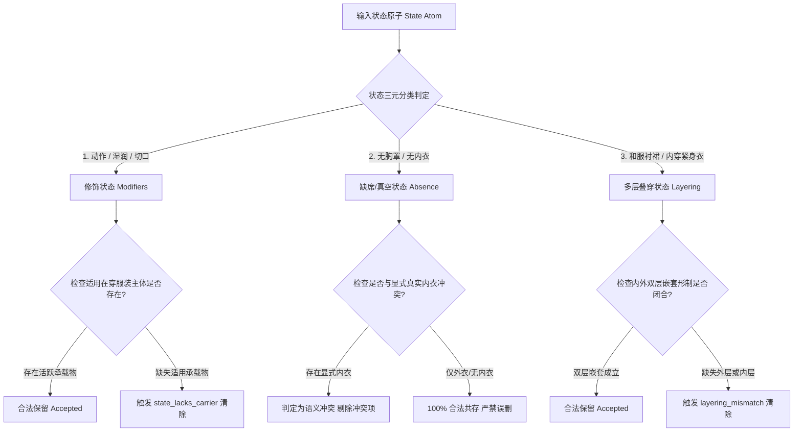
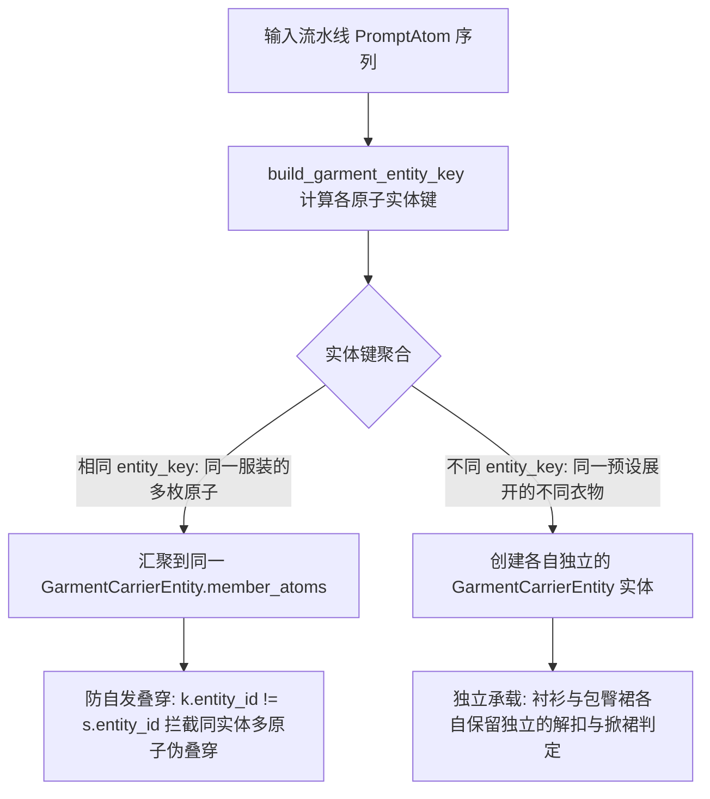
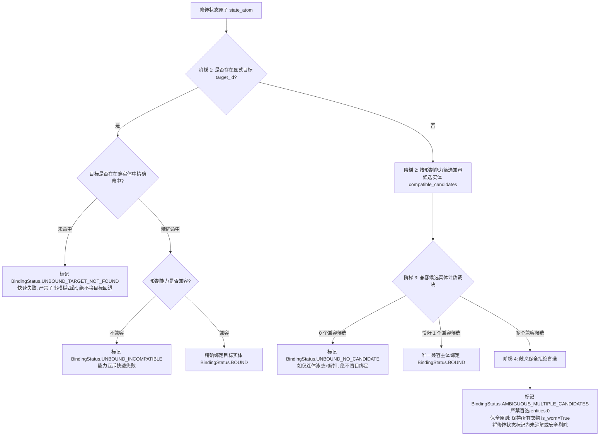

# 服装主体与修饰状态承载绑定规约 (Carrier-State Binding Specification)

> **文档性质**：**Milestone 2 核心实物交付材料**  
> **设计目的**：彻底解决物理依存性、状态悬空、状态自我承载蒙蔽、缺席/真空状态误删、多层叠穿嵌套关系、以及解扣/掀裙能力判别的底层建模问题，作为 M3 消解算法与末端防残留后处理的唯一规范依据。

---

## 目录
1. [承载主体全域识别与准入契约](#一承载主体全域识别与准入契约)
2. [状态三元分类模型与判定逻辑](#二状态三元分类模型与判定逻辑)
3. [排除状态与主体注销机制](#三排除状态与主体注销机制)
4. [解扣与掀裙能力三态契约](#四解扣与掀裙能力三态契约)
5. [末端悬空与冲突判定算法实现伪代码](#五末端悬空与冲突判定算法实现伪代码)

---

## 一、承载主体全域识别与准入契约

### 1. 承载物全域白名单
并非只有 `clothing` 槽位产出承载物。在全系统 18 槽位中，能够作为修饰状态（解扣、掀裙、湿身等）承载主体的原子，必须满足以下全域准入契约：

| 运行时槽位 (Slot) | 归属 JSON 数据键 | 合法 `provenance.kind` | 允许承载的形制拓扑 | 典型代表条目 |
|---|---|---|---|---|
| `clothing` (基础服装) | `clothing.json -> categories` | `clothing`, `base_clothing` | `one_piece`, `top`, `bottom_pants`, `bottom_skirt`, `outerwear` | 旗袍、西装、衬衫、百褶裙、风衣等 |
| `clothing` (服装扩展/联动) | `clothing.json -> categories` | `clothing_extension` | `one_piece`, `top`, `bottom_skirt`, `underwear` | 露肤扩展件、联动差分部件 |
| `lingerie` (情趣衣柜) | `clothing.json -> lingerie_wardrobe` | `lingerie`, `lingerie_wardrobe` | `underwear`, `one_piece`, `top` | 蕾丝内衣、连体情趣衣、开裆无底内裤 (`crotchless_panties`)、基础内衣 (`basic_underwear`) |
| `jewelry` (外穿配饰物) | `accessories.json -> headwear_jewelry` | `jewelry`, `headwear_jewelry` | 仅限外穿性披肩与斗篷 (`outerwear`) | 无帽长披风 (`cloak`)、连帽防风斗篷 (`hooded_cloak`)、套头小披风 (`poncho`)、皮草披肩 (`fur_shawl`) |

> [!NOTE]
> **术语一致性规范**：
> - `accessories.json` 中的数据键统一为 `headwear_jewelry`；
> - 运行时流水线中的槽位名（Slot）统一为 `jewelry`；
> - 规约与代码中严禁两词交替混淆使用。

> [!CRITICAL]
> **状态防自我承载铁律 (Anti-Self-Carrier Invariant)**：
> 任何来源为 `clothing_state`、或其 `provenance.kind == "clothing_state"` 的原子，**绝对不得被识别为承载主体**！
> 即使状态原子为表达“作用于裙摆”而在元数据中标记了 `garment_topologies: ["bottom_skirt"]`，承载物扫描器必须强制过滤掉所有状态原子，彻底杜绝“状态成为自身承载物”的逻辑死循环。

---

## 二、状态三元分类模型与判定逻辑

必须打破“所有状态都需要现存承载物”的单一假设。根据物理语义与依存关系，将服装状态严格划分为三大类别：



### 1. 类别一：修饰状态 (Modifiers: 动作、湿润、切口)
- **典型状态条目**：
  - 动作类：`unbuttoned` (解扣), `lifted_up` (掀裙), `pulled_down` (拉下), `disheveled` (衣衫凌乱), `slipping_off` (半脱滑落)
  - 湿润类：`wet_clinging` (湿润紧贴), `wet_pure` (纯粹湿身), `sweat_soaked` (汗湿)
  - 切口/剪裁类：`heart_cutout` (胸口心型镂空), `back_cutout` (大露背剪裁), `underboob_cutout` (下胸微露切口), `torn_shredded` (撕裂破损), `off_shoulder_cut` (露单肩剪裁), `bare_shoulders` (露双肩状态)
  - 质感类：`taut_tight` (紧绷勾勒)
- **判定方式**：
  - 必须依附于在穿的有效承载主体 (`active_carrier`)；
  - 若所需形制的有效承载物不存在（如无纽扣服装遇到 `unbuttoned`、裤装遇到 `lifted_up`、完全裸体遇到 `wet_clinging`），判定为物理悬空，触发 `state_lacks_carrier` 执行 Drop 并记入账本。

### 2. 类别二：缺席/真空状态 (Absence / Negation)
- **典型状态条目**：
  - `braless` (真空无胸罩 / 脱去胸罩)
  - `underwearless` (真空无内裤 / 彻底不穿内衣)
- **物理语义**：
  - 明确断言该部位的内衣“不存在”；
- **判定方式与防误删铁律**：
  - **绝不能因“没有内衣承载物”而判定为悬空误删**！真空状态本身即表明内衣缺席；
  - **唯一冲突检查条件**：检查当前激活上下文是否存在**显式穿着的内衣主体**（如 `lingerie_lace`, `basic_underwear`, `bikini_classic` 等）；
  - **消解决策**：
    - 若场景中显式存在同层内衣，判定为“真空声明与实际穿着内衣自相矛盾”，Drop 冲突方；
    - 若场景中仅有外穿服装（如大衣、西装、衬衫、连衣裙、校服），或者处于无内衣状态，`braless` / `underwearless` **100% 绝对合法共存**！

### 3. 类别三：多层叠穿状态 (Layering / Nesting)
- **典型状态条目**：
  - `skirt_under_kimono` (和服内穿衬裙层次叠穿)
  - `undergarment_leotard` (外套/大衣下内穿紧身连体衣叠穿)
- **物理语义**：
  - 描述外层主服装与内层特定形制服装之间的双层物理嵌套关系；
- **判定方式**：
  - 不能仅凭“存在任意一件服装”就判定通过，也不能将其视为单件服装的普通修饰词；
  - **嵌套形制闭环检查**：
    - `skirt_under_kimono`：必须同时验证外层是否存在和服/传统长袍类服装（`kimono`, `yukata`, `furisode`, `robe_general`, `taoist_robe` 等），且内层/下身具备裙装形制（`bottom_skirt` 或带裙形制）；
    - `undergarment_leotard`：必须验证外层是否存在具备覆盖能力的主服装（`outerwear`, `dress`, `robe`, `business_suit` 等）。
  - 若外层或内层形制不匹配，触发 `layering_mismatch` 决策进行规范化剔除。

---

## 三、服装实体模型化、绑定契约与主体注销机制

### 1. 区分来源与实体身份：稳定的服装实体键契约 (Stable Garment Entity Key)
为防止底层语义建模缺陷，必须彻底解耦**来源上下文 (Provenance / Origin)** 与**物理服装实体 (Physical Garment Entity)**：
- **概念隔离**：`origin.parent_ids` 或 `origin.mode` 表达的是上游生成线索（例如预设模板 `preset:preset_ol`、风格配方 `recipe:cyberpunk_suit`、或分类目录 `clothing`），而**非单件独立物理服装**；
- **合并漏洞消除**：一个预设（如 `preset_ol`，职场女性）通常展开为多件服装部件——上装衬衫（`shirts_blouses`，top）、下装包臀裙（`pencil_skirt`，bottom_skirt）以及内衣（`lace_bra`，underwear）。若直接使用 `parent_ids[0]` 作为实体键，将导致衬衫和裙子被错误合并为同一个实体，从而造成掀裙能力与解扣能力紊乱；
- **服装实体键规范化算法 (`build_garment_entity_key`)**：
  物理服装实体键必须具备全局唯一性、拓扑部件隔离性与多次采样跨环境稳定性：
  1. **普通单选 (Direct Slot Selection)**：`mode in ("explicit", "random", "auto")`  
     - 主服装：`garment:{slot}:{atom.source_item_id or atom.origin.selected_id}` (例如 `garment:clothing:kimono`)；
     - 独立外穿配饰：`garment:{slot}:{atom.source_item_id}` (例如 `garment:jewelry:cloak`)；
     - 独立内衣：`garment:{slot}:{atom.source_item_id}` (例如 `garment:lingerie:basic_underwear`)。
  2. **复合模板展开 (Preset / Recipe Expansion)**：`mode in ("preset", "recipe")`  
     - 实体键格式：`{origin.mode}:{parent_id}#{effective_slot}#{item_id}`；
     - **关键不变式**：同一预设 `preset_ol` 展开的衬衫与裙子生成不同键：
       - 上装实体键：`preset:preset_ol#clothing#shirts_blouses`
       - 下装实体键：`preset:preset_ol#clothing#pencil_skirt`
       - **绝对禁止将两者合并为同一个实体！**
  3. **服装扩展件 (Clothing Extension)**：  
     - 若为附属于主衣物的差分/修饰部件，实体键对齐主衣物实体键；若为独立附加层，生成独立扩展键。
  4. **同一服装多原子聚合**：  
     - 同一件和服（`kimono`）的主体标签、领口标签与下摆标签，因其 `slot` 与 `item_id` 完全相同，生成完全一致的实体键，自动汇聚入该实体的 `member_atoms`；
     - 同一预设下不同部件（`shirts_blouses` vs `pencil_skirt`）生成不同实体键，保留为两个独立实体。



### 2. 绑定必须有明确依据：四阶判定梯与拒绝盲选契约 (Binding Ladder & Refusal of Arbitrary Fallback)
消解器在定位修饰状态（如 `discarded`、`unbuttoned`、`lifted_up`）的宿主实体时，必须遵循严格的**四阶确定性绑定决策阶梯**，**严禁使用 `entities[0]` 进行顺序盲选**：



- **阶梯 1 (显式目标精确匹配与快速失败)**：若状态指定了目标（通过参数 `target_id` 或原子属性 `target_id`，**绝不与来源 `parent_ids` 混淆**），必须在活跃在穿实体中进行**规范 ID 精确相等匹配**（`selected_id == target_id or entity_id == target_id`），**绝对禁止 `target_pid in e.entity_id` 等子串模糊匹配**（例如目标为 `shirt` 时严禁模糊命中 `shirts_blouses`）。若目标未命中，立即返回 `UNBOUND_TARGET_NOT_FOUND`，**绝不回退改绑其他服装**；若目标命中但物理形制不兼容（例如目标指定为无纽扣连体泳衣，却施加解扣动作），立即返回 `UNBOUND_INCOMPATIBLE`，快速失败；
- **阶梯 2 (形制能力集合筛选 - Capability Filtering)**：无显式目标时，根据状态原子的物理动作需求筛选具备相应能力的活跃服装实体集合（`compatible_candidates`）：
  - `lifted_up` (掀裙)：过滤具备裙摆形制且允许掀裙的实体（排除裤装、筒裙开衩及 `NON_SKIRT_ONE_PIECE` 如连体泳衣、背带裤、旗袍等）；
  - `unbuttoned` (解扣)：过滤具备前襟门扣能力的实体（在 `ALLOWED_BUTTON_STYLES` 范围内的款式）；
  - `pulled_down` (拉下)：过滤具备下身裤/裙/内裤形制的实体；
  - 通用修饰或 `discarded`：全场所有活跃在穿服装实体均具备承载能力；
- **阶梯 3 (兼容候选计数裁决 - Candidate Count Resolution)**：
  - **零兼容候选 (`len == 0`)**：直接返回 `BindingStatus.UNBOUND_NO_CANDIDATE`。例如场景中仅有连体泳衣（`swimsuit_school`）搭配解扣状态，连体泳衣不具备纽扣形制，直接判定为无兼容承载物，**绝对禁止因“全场唯一实体”而无视能力盲目绑定**；
  - **单兼容候选 (`len == 1`)**：恰好有且仅有 1 个实体具备承载能力，确定性绑定该实体并返回 `BindingStatus.BOUND`；
- **阶梯 4 (多候选歧义拒绝与保全原则 - Ambiguity Refusal & Fail-Safe Preservation)**：
  - 若兼容候选实体大于 1（例如上衣与外套均有纽扣，未指定解扣哪一件；或衬衫与裙子并存，收到未指定具体目标的 `discarded` 状态）：
    - **严禁随意选择 `entities[0]` 退回！** 盲选第一个实体将导致“原子输入换序即注销不同衣服”的位置偏差漏洞；
    - 返回 `BindingStatus.AMBIGUOUS_MULTIPLE_CANDIDATES`，记录歧义证据 `ambiguous_carrier_binding` 至审计报告；
    - **保全原则 (Fail-Safe Preservation)**：消解器**绝不注销任何一件衣物实体**（所有衣物保持 `is_worn=True`）；无法判定目标的歧义修饰状态被安全剔除或保留警告，保证系统行为确定、换序不变（Permutation Invariant）。

### 3. 排除状态与主体注销机制 (`discarded` 精准注销)
- **同步精准注销**：当场景中出现 `discarded`（脱掉散落一旁 / 脱在地上）并通过绑定阶梯锁定唯一目标实体时，将该实体及其所有 `member_atoms` 同步标记为 `is_worn=False, is_ambient=True`，彻底注销其承载资格；非目标实体 100% 完好不受影响；
- **状态排除与影响矩阵**：

| 排除状态 | 触发条件 | 作用机制与语义更新 | 对承载物能力的影响 |
|---|---|---|---|
| **`discarded`** (脱下散落) | 独立状态原子为 `discarded`，或服装原子携带 `discarded` | 通过四阶绑定锁定目标实体，将其标记为 `is_worn=False, is_ambient=True`，其全部 member_atoms 降级为环境背景道具 | **彻底注销**该实体的承载资格；非目标实体不受影响；若存在歧义则拒绝盲选 |
| **`removed`** (脱除剔除) | 被高层裸露规则 (L5/L6) 或冲突消解器 Drop | 从全局活跃原子池中物理移除 | 彻底丧失一切承载能力 |
| **`loosened`** (衣衫松散) | 状态标注为松散敞开 | 保持 `is_worn=True` | **保留完整承载能力**，不注销主体 |

---

## 四、服装主体的解扣与掀裙能力三态契约

各服装形制严格实施**允许 (Allowed)、禁止 (Prohibited)、不适用 (N/A) / 未知 (Unknown)** 三态能力模型：

### 1. 解扣能力模型 (Button Capability)
| 能力状态 | 判定依据 | 典型款式清单 | 当修饰状态为 `unbuttoned` 时的消解行为 |
|---|---|---|---|
| **允许 (Allowed)** | 款式形制明确具备前门襟纽扣、拉链、排扣或盘扣 | `business_suit`, `shirts_blouses`, `trench_coat`, `lab_coat`, `dungarees`, `dirndl_dress`, `qipao`, `fast_food_uniform`, `denim_jacket`, `down_jacket`, `safari_jacket`, `duffel_coat`, `tailcoat`, `firefighter_gear`, `blazer_uniform`, `clerical_priest` | **100% 允许共存**，规则绝不误删 |
| **禁止 (Prohibited)** | 款式为一体式无门襟剪裁、套头结构或系绳设计，物理上无纽扣可解 | `bikini_classic`, `bikini_strappy`, `bikini_micro`, `swimsuit_classic`, `swimsuit_school`, `swimsuit_competition`, `swimsuit_creative`, `leotard_bodysuit`, `latex_catsuit`, `zentai_suit`, `t_shirt`, `sweatshirt`, `hoodie`, `knit_sweater`, `crop_top` | **判定为结构互斥**，款式主体保留，`unbuttoned` 状态被 Drop |
| **不适用 (N/A)** | 下装裤裙或头部配饰，无胸襟纽扣概念 | `pencil_skirt`, `pleated_skirt`, `denim_shorts`, `hot_pants`, `black_leggings`, `waist_belt` | 需交由上身主件承载判定 |

### 2. 掀裙能力模型 (Skirt Lift Capability)
| 能力状态 | 判定依据 | 典型款式清单 | 当修饰状态为 `lifted_up` 时的消解行为 |
|---|---|---|---|
| **允许 (Allowed)** | 款式包含裙摆形制 (`bottom_skirt` 或带裙摆的 `one_piece`) | `pleated_skirt`, `miniskirt`, `pencil_skirt`, `layered_skirt`, `long_skirt`, `pettiskirt`, `tutu_skirt`, `pumpkin_skirt`, `dirndl_dress`, `apron_dress`, `summer_sundress`, `dress_casual`, `chiffon_dress`, `tulle_dress`, `jk_seifuku` | **100% 允许共存**，规则绝不误删 |
| **禁止 (Prohibited)** | 款式仅具备裤装形制 (`bottom_pants`)，或为侧开衩筒裙/无裙摆结构，物理上无裙摆可掀 | `denim_shorts`, `hot_pants`, `black_leggings`, `dungarees`, `volleyball_uniform`, `gym_uniform`, `business_suit`, `combat_tactical`, `tailcoat`, `military_uniform`, `qipao` | **判定为结构互斥**，服装主体保留，`lifted_up` 状态被 Drop |
| **不适用 (N/A)** | 纯上装或无下身形制单件 | `shirts_blouses`, `crop_top`, `outerwear_jacket`, `hoodie` | 必须依附于场景中配套的下身裙装 |

> [!NOTE]
> **旗袍 (`qipao`) 掀裙能力权威界定**：
> 旗袍作为传统中式一体剪裁服装，其解扣能力为“允许”（领口中式盘扣可解）；但其形制特征为贴身筒裙与侧面高开衩，物理表现为开衩露腿，不可整圈向上撩掀裙摆。因此在掀裙判定模型与算法伪代码中，**旗袍均严格设定为“禁止”（纳入 `NON_SKIRT_ONE_PIECE`）**，与台账及 109 款规格表 100% 绝对一致。

---

## 五、末端悬空与冲突判定算法实现伪代码

```python
"""
carrier_state_resolver.py — 承载状态消解与防残留清理核心算法伪代码
"""
from dataclasses import dataclass
from enum import Enum
from typing import Any, Dict, List, Optional, Sequence, Set, Tuple

class BindingStatus(str, Enum):
    BOUND = "bound"
    UNBOUND_NO_CANDIDATE = "unbound_no_candidate"
    UNBOUND_TARGET_NOT_FOUND = "unbound_target_not_found"
    UNBOUND_INCOMPATIBLE = "unbound_incompatible"
    AMBIGUOUS_MULTIPLE_CANDIDATES = "ambiguous_multiple_candidates"

@dataclass
class BindingResult:
    status: BindingStatus
    target_entity: Optional["GarmentCarrierEntity"] = None
    reason: str = ""

@dataclass
class GarmentCarrierEntity:
    """
    服装实体对象：将同属于同一物理服装的所有成员原子 (PromptAtom) 汇聚为单一实体。
    彻底消除同一服装的多原子误判为独立叠穿的语义漏洞，同时保障同一预设下不同部件的独立实体性。
    """
    entity_id: str                      # 实体的全局稳定物理件标识 (由 build_garment_entity_key 生成)
    selector: str                       # 槽位选择器，如 "clothing", "lingerie", "jewelry"
    selected_id: str                    # 款式规范 ID，如 "kimono", "shirts_blouses", "pencil_skirt"
    member_atoms: List[PromptAtom]      # 属于该服装实体的所有原子集合
    is_worn: bool = True                # 是否在穿（默认在穿）
    is_ambient: bool = False            # 是否脱落/遗弃为环境道具
    discarded_by: Optional[PromptAtom] = None  # 导致该实体注销的 discarded 状态原子

MODIFIER_ACTIONS = {"unbuttoned", "lifted_up", "pulled_down", "disheveled", "slipping_off"}
MODIFIER_WETNESS = {"wet_clinging", "wet_pure", "sweat_soaked"}
MODIFIER_CUTOUTS = {"heart_cutout", "back_cutout", "underboob_cutout", "torn_shredded", "off_shoulder_cut", "bare_shoulders", "taut_tight"}
ABSENCE_STATES = {"braless", "underwearless"}
LAYERING_STATES = {"skirt_under_kimono", "undergarment_leotard"}

ALLOWED_BUTTON_STYLES = {
    "business_suit", "shirts_blouses", "trench_coat", "lab_coat", "dungarees",
    "dirndl_dress", "qipao", "fast_food_uniform", "denim_jacket", "down_jacket",
    "safari_jacket", "duffel_coat", "tailcoat", "firefighter_gear", "blazer_uniform",
    "clerical_priest", "military_uniform", "military_overcoat", "outerwear_coat",
    "outerwear_overcoat", "outerwear_jacket", "soft_shell_jacket", "rainwear_coat",
    "bathrobe", "combat_tactical", "convenience_store", "frock_smock", "hospital_gown",
}

# 连体服但无裙摆的款式清单 (必须包含存量 one_piece_swimsuit、dungarees 以及旗袍 qipao)
NON_SKIRT_ONE_PIECE = {
    "latex_catsuit", "zentai_suit", "leotard_bodysuit", "mecha_power_armor",
    "mecha_exoskeleton", "racing_suit", "swimsuit_classic", "swimsuit_school",
    "swimsuit_competition", "swimsuit_creative", "one_piece_swimsuit", "dungarees",
    "qipao",  # 旗袍：传统贴身剪裁与侧高开衩，严格禁止整圈撩掀裙摆，与规格表100%一致
}

KIMONO_LIKE_STYLES = {"kimono", "yukata", "furisode", "robe_general", "taoist_robe", "battle_robe"}
EXPLICIT_BRA_STYLES = {"lingerie_lace", "bikini_classic", "bikini_strappy", "bikini_micro"}
EXPLICIT_PANTIES_STYLES = {"basic_underwear", "crotchless_panties", "bikini_classic", "bikini_strappy", "bikini_micro"}


def is_garment_compatible_with_state(entity: GarmentCarrierEntity, state_id: str) -> bool:
    """判定服装实体是否具备承载特定状态原子的物理形制能力。"""
    if state_id == "lifted_up":
        return any(
            a.facts and (
                "bottom_skirt" in a.facts.garment_topologies or 
                ("one_piece" in a.facts.garment_topologies and entity.selected_id not in NON_SKIRT_ONE_PIECE)
            )
            for a in entity.member_atoms
        )
    elif state_id == "unbuttoned":
        return entity.selected_id in ALLOWED_BUTTON_STYLES
    elif state_id == "pulled_down":
        return any(
            a.facts and any(t in a.facts.garment_topologies for t in ("bottom_pants", "bottom_skirt", "underwear"))
            for a in entity.member_atoms
        )
    # 对于 discarded 或通用服装状态，任何活跃服装实体均可作为候选
    return True


def build_garment_entity_key(atom: PromptAtom) -> Optional[str]:
    """
    区分来源 (Provenance) 与实体身份 (Garment Entity Identity)。
    计算原子的物理服装实体唯一键。
    若原子为非承载物（如 clothing_state、纯质感修饰等），返回 None。
    """
    if (atom.origin and atom.origin.selector == "clothing_state") or (atom.provenance and atom.provenance.kind == "clothing_state"):
        return None

    slot = atom.origin.selector if atom.origin else (atom.source_slot or "")
    prov_kind = atom.provenance.kind if atom.provenance else ""
    item_id = atom.source_item_id or (atom.origin.selected_id if atom.origin else "") or atom.id

    is_carrier = False
    if slot in ("clothing", "base_clothing") or prov_kind in ("clothing", "base_clothing", "clothing_extension"):
        is_carrier = True
    elif slot == "lingerie" or prov_kind in ("lingerie", "lingerie_wardrobe"):
        is_carrier = True
    elif slot == "jewelry" or prov_kind in ("jewelry", "headwear_jewelry"):
        if item_id in ("cloak", "hooded_cloak", "poncho", "fur_shawl"):
            is_carrier = True

    if not is_carrier:
        return None

    mode = atom.origin.mode if atom.origin else "explicit"
    # 复合模板展开 (preset / recipe)：必须包含 item_id 隔离不同部件，严禁合并
    if mode in ("preset", "recipe") and atom.origin and atom.origin.parent_ids:
        parent_id = atom.origin.parent_ids[0]
        return f"{mode}:{parent_id}#{slot}#{item_id}"

    # 普通单选：按 slot 与 item_id 生成
    return f"garment:{slot}:{item_id}"


def extract_garment_entities(active_atoms: Sequence[PromptAtom]) -> Dict[str, GarmentCarrierEntity]:
    """
    全域扫描 PromptAtom 序列，按稳定的服装实体键聚合物理服装实体。
    - 同一服装多原子（如和服主体+下摆）汇聚入同一实体；
    - 同一预设展开的不同服装（如衬衫+裙子）保留为不同实体。
    """
    entities_map: Dict[str, GarmentCarrierEntity] = {}
    for a in active_atoms:
        ekey = build_garment_entity_key(a)
        if not ekey:
            continue
        slot = a.origin.selector if a.origin else (a.source_slot or "")
        item_id = a.source_item_id or (a.origin.selected_id if a.origin else "") or a.id
        if ekey not in entities_map:
            entities_map[ekey] = GarmentCarrierEntity(
                entity_id=ekey,
                selector=slot,
                selected_id=item_id,
                member_atoms=[a],
                is_worn=True,
                is_ambient=False,
            )
        else:
            entities_map[ekey].member_atoms.append(a)
    return entities_map


def find_bound_carrier(
    state_atom: PromptAtom,
    entities: Sequence[GarmentCarrierEntity],
    target_id: Optional[str] = None,
) -> BindingResult:
    """
    依据四阶确定性绑定决策阶梯定位修饰状态所绑定的服装实体：
    1. 显式目标必须采用规范 ID 精确匹配（严禁子串模糊匹配），未命中或不兼容直接快速失败，绝不换目标回退；
    2. 无显式目标时统一基于形制能力筛选兼容候选实体；
    3. 区分零兼容候选 (UNBOUND_NO_CANDIDATE)、单兼容候选 (BOUND) 与多兼容候选 (AMBIGUOUS_MULTIPLE_CANDIDATES)；
    4. 严格拒绝 entities[0] 盲选！
    """
    active_entities = [e for e in entities if e.is_worn and not e.is_ambient]
    if not active_entities:
        return BindingResult(status=BindingStatus.UNBOUND_NO_CANDIDATE, reason="no_active_garments")

    state_id = state_atom.source_item_id or (state_atom.origin.selected_id if state_atom.origin else "") or state_atom.text

    # 提取显式目标（函数参数优先，其次为原子属性 target_id，绝不与来源 parent_ids 混淆）
    effective_target_id = target_id if target_id is not None else getattr(state_atom, "target_id", None)

    # 阶梯 1：显式目标匹配（精确匹配，快速失败，绝不回退改绑其他衣物）
    if effective_target_id is not None:
        matched = [
            e for e in active_entities
            if e.selected_id == effective_target_id or e.entity_id == effective_target_id
        ]
        if not matched:
            return BindingResult(
                status=BindingStatus.UNBOUND_TARGET_NOT_FOUND,
                reason=f"explicit_target_not_found: {effective_target_id}",
            )
        if len(matched) == 1:
            target_entity = matched[0]
            if not is_garment_compatible_with_state(target_entity, state_id):
                return BindingResult(
                    status=BindingStatus.UNBOUND_INCOMPATIBLE,
                    target_entity=target_entity,
                    reason=f"target_incompatible: entity '{target_entity.selected_id}' cannot accept state '{state_id}'",
                )
            return BindingResult(
                status=BindingStatus.BOUND,
                target_entity=target_entity,
                reason="explicit_target_match",
            )
        else:
            compatible_matched = [e for e in matched if is_garment_compatible_with_state(e, state_id)]
            if len(compatible_matched) == 1:
                return BindingResult(
                    status=BindingStatus.BOUND,
                    target_entity=compatible_matched[0],
                    reason="explicit_target_match",
                )
            elif not compatible_matched:
                return BindingResult(
                    status=BindingStatus.UNBOUND_INCOMPATIBLE,
                    reason=f"explicit_target_incompatible: {effective_target_id}",
                )
            else:
                return BindingResult(
                    status=BindingStatus.AMBIGUOUS_MULTIPLE_CANDIDATES,
                    reason=f"multiple_explicit_targets_ambiguous: {effective_target_id}",
                )

    # 阶梯 2：无显式目标时，按形制能力筛选兼容候选集合
    compatible_candidates = [
        e for e in active_entities
        if is_garment_compatible_with_state(e, state_id)
    ]

    # 阶梯 3：零候选或单候选确定性裁决（区分“零兼容候选”和“单兼容候选”）
    if len(compatible_candidates) == 0:
        return BindingResult(
            status=BindingStatus.UNBOUND_NO_CANDIDATE,
            reason=f"no_compatible_candidate_for_state: {state_id}",
        )
    elif len(compatible_candidates) == 1:
        reason = "single_compatible_candidate_match"
        if state_id == "lifted_up":
            reason = "skirt_capability_unique_match"
        elif state_id == "unbuttoned":
            reason = "button_capability_unique_match"
        elif state_id == "pulled_down":
            reason = "pulled_capability_unique_match"
        return BindingResult(
            status=BindingStatus.BOUND,
            target_entity=compatible_candidates[0],
            reason=reason,
        )

    # 阶梯 4：多候选歧义拒绝与保全原则（严禁 entities[0] 盲选！）
    return BindingResult(
        status=BindingStatus.AMBIGUOUS_MULTIPLE_CANDIDATES,
        reason=f"ambiguous_carrier_binding: {len(compatible_candidates)} candidates",
    )


def resolve_carrier_state_bindings(active_atoms: List[PromptAtom]) -> List[Decision]:
    decisions: List[Decision] = []
    unresolved_conflicts: List[Dict[str, Any]] = []
    
    # -------------------------------------------------------------
    # 步骤 1：全域主体扫描与稳定实体聚合
    # -------------------------------------------------------------
    entities_map = extract_garment_entities(active_atoms)

    # 提取具体 discarded 状态原子，并实施精准实体绑定与注销 (严禁盲选 entities[0])
    discarded_atoms = [
        a for a in active_atoms 
        if (a.origin and a.origin.selected_id == "discarded") or 
           (a.facts and "discarded" in a.facts.garment_states)
    ]
    for da in discarded_atoms:
        binding = find_bound_carrier(da, list(entities_map.values()))
        if binding.status == BindingStatus.BOUND and binding.target_entity:
            # 锁定目标实体：同步注销其所有成员原子
            target_entity = binding.target_entity
            target_entity.is_worn = False
            target_entity.is_ambient = True
            target_entity.discarded_by = da
        elif binding.status == BindingStatus.AMBIGUOUS_MULTIPLE_CANDIDATES:
            # 歧义保全：严禁注销任何一件衣物，记录歧义
            unresolved_conflicts.append({
                "reason": "ambiguous_carrier_binding",
                "state_atom_id": da.atom_id,
                "candidate_entity_ids": [e.entity_id for e in entities_map.values() if e.is_worn],
            })

    # 仅提取在穿 (is_worn=True 且 not is_ambient) 的活跃服装实体
    active_entities: List[GarmentCarrierEntity] = [
        e for e in entities_map.values() if e.is_worn and not e.is_ambient
    ]

    # 提取承载实体拓扑特征与能力查表
    has_skirt = any(
        any(
            a.facts and ("bottom_skirt" in a.facts.garment_topologies or 
            ("one_piece" in a.facts.garment_topologies and e.selected_id not in NON_SKIRT_ONE_PIECE))
            for a in e.member_atoms
        )
        for e in active_entities
    )
    has_buttonable = any(
        e.selected_id in ALLOWED_BUTTON_STYLES
        for e in active_entities
    )
    has_any_garment = len(active_entities) > 0
    
    # 和服叠穿：外层和服类与内层裙子必须是两个不同的独立服装实体 (entity_id 不同，防单件多原子自发满足)
    kimono_outer_entities = [
        e for e in active_entities 
        if e.selected_id in KIMONO_LIKE_STYLES
    ]
    skirt_inner_entities = [
        e for e in active_entities 
        if any(
            a.facts and ("bottom_skirt" in a.facts.garment_topologies or 
            ("one_piece" in a.facts.garment_topologies and e.selected_id not in NON_SKIRT_ONE_PIECE))
            for a in e.member_atoms
        )
    ]
    has_distinct_kimono_and_skirt = any(
        k.entity_id != s.entity_id for k in kimono_outer_entities for s in skirt_inner_entities
    )

    # 紧身衣叠穿：验证是否存在内层紧身衣实体与具备覆盖能力的外层服装实体 (双层实体)
    leotard_entities = [
        e for e in active_entities
        if e.selected_id in ("leotard_bodysuit", "latex_catsuit", "zentai_suit")
    ]
    outer_covering_entities = [
        e for e in active_entities
        if any(
            a.facts and any(t in a.facts.garment_topologies for t in ("outerwear", "one_piece", "top"))
            and e.selected_id not in NON_SKIRT_ONE_PIECE
            for a in e.member_atoms
        )
    ]
    has_outer_covering = any(
        leo.entity_id != out.entity_id
        for leo in leotard_entities
        for out in outer_covering_entities
    )

    # 区分显式文胸与显式内裤 (实体级白名单与原子级事实，绝不混淆)
    has_explicit_bra = any(
        (e.selected_id in EXPLICIT_BRA_STYLES) or
        any(a.facts and "upper_body" in a.facts.visible_regions and "underwear" in a.facts.garment_topologies for a in e.member_atoms)
        for e in active_entities
    )
    has_explicit_panties = any(
        (e.selected_id in EXPLICIT_PANTIES_STYLES) or
        any(a.facts and "lower_body" in a.facts.visible_regions and "underwear" in a.facts.garment_topologies for a in e.member_atoms)
        for e in active_entities
    )

    # -------------------------------------------------------------
    # 步骤 2：状态三元分类消解
    # -------------------------------------------------------------
    state_atoms = [
        a for a in active_atoms 
        if (a.origin and a.origin.selector == "clothing_state") or 
           (a.provenance and a.provenance.kind == "clothing_state")
    ]
    
    for sa in state_atoms:
        sid = sa.origin.selected_id if sa.origin else sa.text
        drop_reason = ""
        
        # 类别 1：修饰状态 (Modifiers) -> 必须依附在穿承载实体
        if sid in MODIFIER_ACTIONS:
            if sid == "lifted_up" and not has_skirt:
                drop_reason = "state_lacks_carrier"
            elif sid == "unbuttoned" and not has_buttonable:
                drop_reason = "state_lacks_carrier"
            elif sid == "pulled_down":
                # 拉下动作：必须有在穿的上装、下装、内衣或连体衣承载实体
                has_pullable = any(
                    any(a.facts and any(t in a.facts.garment_topologies for t in ("top", "bottom_pants", "bottom_skirt", "underwear", "one_piece")) for a in e.member_atoms)
                    for e in active_entities
                )
                if not has_pullable:
                    drop_reason = "state_lacks_carrier"
            elif sid in ("disheveled", "slipping_off"):
                # 衣衫凌乱 / 半脱滑落：必须有任意在穿服装实体
                if not has_any_garment:
                    drop_reason = "state_lacks_carrier"
                    
        elif sid in MODIFIER_WETNESS or sid in MODIFIER_CUTOUTS:
            if not has_any_garment:
                drop_reason = "state_lacks_carrier"
                
        # 类别 2：缺席/真空状态 (Absence) -> 绝不因缺内衣误删，细分文胸与内裤冲突检查
        elif sid in ABSENCE_STATES:
            if sid == "braless" and has_explicit_bra:
                drop_reason = "absence_state_conflict"
            elif sid == "underwearless" and has_explicit_panties:
                drop_reason = "absence_state_conflict"
            else:
                # 场景无显式对应内衣，100% 合法共存，绝不 Drop
                drop_reason = ""
                
        # 类别 3：多层叠穿状态 (Layering) -> 双层实体拓扑嵌套闭环检查
        elif sid in LAYERING_STATES:
            if sid == "skirt_under_kimono":
                # 必须外层有和服且内层有裙子，且二者不可为同一件服装实体
                if not has_distinct_kimono_and_skirt:
                    drop_reason = "layering_mismatch"
            elif sid == "undergarment_leotard":
                # 衣服下紧身衣：必须存在具备覆盖能力的独立外层服装实体
                if not has_outer_covering:
                    drop_reason = "layering_mismatch"

        # 执行 Drop 并满足审计守恒律
        if drop_reason and sa.can_delete_atom:
            decisions.append(make_drop_decision(
                rule_id="dangling_modifier_cleanup",
                phase="post_processing",
                reason=drop_reason,
                loser=sa,
                winner=()
            ))
            
    return decisions
```

