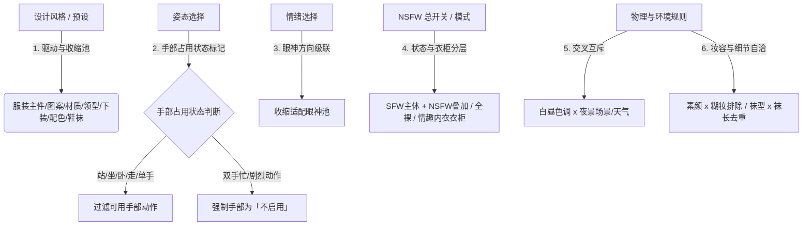

# K2 人像提示词生成器联动机制深度剖析与 ComfyUI-IYKYK 升级方案

## 📖 概述

本文档对 **K2 人像提示词生成器（v0.4.16）** 的核心联动机制进行了系统性解构，并对比了 **ComfyUI-IYKYK** 的现状。K2 在多维人像提示词生成领域展现了极高的**物理真实感**、**语义自洽度**与**工程完备性**，其核心联动哲学与防冲突体系非常值得 IYKYK 深度借鉴。

---

## 🎯 一、K2 核心联动机制的 6 大精髓解构

---

### 1. 风格驱动池体系（`STYLE_POOLS` & `STYLE_COLOR_POOLS`）
- **核心逻辑**：
  - 选中「设计风格一键搭配」（如法式优雅、千禧辣妹、美式学院、新中式等）后，**不单是做一次性赋值**，而是**实时动态收缩**后续 10+ 个子维度的选项池（材质 `clothMat`、图案 `clothPattern`、衣领 `collarStyle`、外套 `outerwear`、上装长度 `topLength`、下装样式 `bottomStyle`、下装长度 `bottomLength`、上下装配色 `splitColor`、袜子三维 `sockType/Len/Color`、鞋履 `shoes`）。
  - 当切换风格时，不适配的旧值**自动回落**到合法适配项；
  - 只有当风格设为「不启用」时，才完全放开全池，进入「自由乱穿」状态；
  - 配备独立的「🧦 袜子随风格/解锁」逃生开关，既保证风格纯正，又允许自由混搭。

### 2. 姿态 × 手部占用状态映射体系（`POSE_HAND` & `HAND_POOLS`）
- **核心逻辑**：
  - 将 120 种姿态逐一严格打标手部占用状态：
    - `站`（35项可用）、`坐`（32项可用）、`卧`（20项可用）、`单手`（18项可用）、`走动`（11项可用）；
    - `双手忙`（53项，如背手、抱臂、系鞋带、大字摊等）：**手部动作仅允许「不启用」**；
    - `剧烈`（10项，如奔跑、跳跃、转圈等）：**手部动作仅允许「不启用」**。
  - **收益**：从根本上消除了 SD / FLUX / Midjourney 中最臭名昭著的**多手、三只手、动作矛盾**（如既抱臂又在托腮）的伪影问题。

### 3. 情绪表情 × 眼神方向动态级联（`EMOTION_EYE`）
- **核心逻辑**：
  - 18 种情绪各配置 2~4 个适配眼神（如「害羞」对应 `羞耻回避 / 温柔注视 / 俏皮眨眼`；「冷淡」对应 `放空虚无 / 直视镜头 / 迷离失神`）；
  - 从情绪词库中剔除内嵌眼神描述，让眼神字段单一职责；
  - **杜绝气质撕裂**：完全消除了「害羞 + 直视镜头 / 挑逗」、「冷淡 + 俏皮眨眼」等自相矛盾的人设崩塌。

### 4. 服装 SFW 基础 + NSFW 分级叠加/全裸/情趣衣柜架构
- **核心逻辑**：
  - **叠加不替代**：SFW 服装描述恒为第一主体，NSFW 穿着状态（`nsfwState`，如 `slipped off shoulder`、`unbuttoned`）作为前置领起句或叠加修饰句，不破坏衣服本身版型与材质。
  - **三大互斥模式**：
    1. **标准叠加态**：SFW 服装 + NSFW 穿着状态（含 9 级 SFW 露肤度镂空 + 5 级透肉，或 4 级 NSFW 接续露肤度）；
    2. **全裸（`nudeOn`）**：彻底隐藏并停用 SFW 服装与「穿着状态」下拉，前置注入全身赤裸描述，避免「穿着裙子 + 身体全裸」的互斥错误；
    3. **情趣内衣衣柜（`lingerieOn`）**：隐藏 SFW 服装，替换为 10 大类 80 款情趣内衣（薄透透视、蕾丝镂空、三点式、连体连袜、开裆免脱、吊袜袜装、束身束缚、制服角色、国风旗袍、皮装乳胶），支持 `主色调 / 辅色调` 自由组合。

### 5. 上下装细分与内置属性归一自洽（`ITEM_C12` & `MAT_FAM12`）
- **核心逻辑**：
  - **上下半身归属前缀**：生成提示词时，为主件添加「上身穿着」、下装添加「下身穿着」，向扩散模型明确指明部位，消除「白衬衫搭配藏青上衣」的部位歧义。
  - **主件内置属性提取**：当主件名称或描述中已包含主色（如白色衬衫）或材质（如丝绒打底）时：
    - `splitColor`（上下装配色）自动锁定上身为主件色系，防止出现「上黑下黑 + 白衬衫」；
    - 材质字段自动回落「不启用」或限定同材质族，防止「丝绒打底 + 牛仔材质」冲突。

### 6. 多维物理环境与妆容鞋袜强自洽
- **色调 × 场景 × 天气**（`WEATHER_TONE_FILTER` / `SCENE_TONE_FILTER`）：日间/中性色光（日光清新/阴天柔灰）严格排除夜景天气（夜色深沉）与夜景场所（后巷/夜店/夜间天台）。
- **妆容 × 糊妆**（`smudgeFilter`）：素颜（裸妆感无妆）强制糊妆为「不启用」，杜绝「素颜 + 眼线口红晕开」的荒谬组合。
- **袜子类型 × 长度**（`SOCK_LEN_FIX`）：过膝长筒袜/吊带袜/分趾袜等自带长度语义时，长度字段强制置空，杜绝重复与冲突；连裤袜严格排除分段短袜。
- **鞋履随主件类别适配**（`SHOE_POOL`）：每类服装配置专属鞋履池（汉服配绣花鞋/云头锦鞋，JK 配乐福鞋/小皮鞋，均恒带「赤脚」逃生口）。

---

## 📊 二、ComfyUI-IYKYK 与 K2 现状对比分析

| 维度 / 机制 | K2 人像提示词生成器 (v0.4.16) | ComfyUI-IYKYK 当前现状 | 差距与优化潜力 |
| :--- | :--- | :--- | :--- |
| **风格预设管控深度** | 强管控：预设实时收缩后续 10+ 字段池，切风格自动回落 | 弱管控：风格配方仅在组装时追加修饰词，不限制下拉池 | ⭐️⭐️⭐️⭐️⭐️ 可引入风格驱动池机制 |
| **姿态与手部防冲突** | 强映射：`POSE_HAND` 7 类状态，53 个双手忙姿态强制手部为空 | 独立采样：姿势动作与道具/饰品各自独立，偶有多手风险 | ⭐️⭐️⭐️⭐️⭐️ 可引入姿态手部占用打标 |
| **情绪与眼神协调度** | 强级联：18 种情绪各配 2~4 个眼神，切情绪眼神动态收缩 | 独立采样：情绪表情与视线角度独立，依赖后置消解 | ⭐️⭐️⭐️⭐️ 可引入情绪-眼神适配映射 |
| **裸露与服装联动层级** | 完整阶梯：SFW/NSFW 露肤度 13 档 + 5 档透肉 + 全裸 + 80 款情趣衣柜 | L1~L6 梯度 + 28 款服装 overrides + 12 状态消解 | ⭐️⭐️⭐️⭐️ 可吸收 K2 的镂空/透肉细分与情趣衣柜类目 |
| **上下装细节连贯性** | 上下装独立拆分（外套/领型/长短/下装/配色/归属前缀） | 服装款式以整体套餐为主（28 种主类别） | ⭐️⭐️⭐️ 可借鉴上下装归属前缀与配色族 |
| **物理环境自洽** | 色温光照、白昼黑夜、天气、场景闭环互斥 | 冲突消解器规则消解（温泉、居酒屋、户外） | ⭐️⭐️⭐️ 可补充色温与黑夜/白昼环境互斥 |

---

## 🚀 三、ComfyUI-IYKYK 架构升级演进方案

结合 ComfyUI 节点式架构与 Python 数据驱动流水线的特性，建议分三阶段将 K2 的优秀机制吸收融入 IYKYK：

### 阶段一：高价值逻辑规则层融合（纯 Python 后端与数据增强）

1. **姿态-手部占用打标（`poses.json` & `conflict_rules.json`）**：
   - 为 `poses.json` 中的全部姿势添加 `hand_state` 属性（`free`, `single_hand`, `busy`, `intense`）；
   - 在 `ConflictResolver` 中建立姿势手部占用规则：当姿势为双手占用（如抱头、背手、抓床单）时，自动剔除道具与饰品中的矛盾手持物（如手持团扇、手握酒杯）。
2. **情绪-眼神适配级联（`expressions.json` & `conflict_rules.json`）**：
   - 建立情绪与眼神方向的兼容映射表；
   - 在采样与冲突消解时，若情绪为害羞/内向，强制将眼神修正为低头/回避，防止人设割裂。
3. **环境与物理自洽规则扩充（`conflict_rules.json`）**：
   - 补充「日间自然光/清新色调」与「深夜场景（夜店/深夜便利店/暗室）」的互斥规则；
   - 补充「素颜」与「浓妆/花妆」的互斥消解。

---

### 阶段二：服装分级强化与情趣衣柜体系扩充

1. **服装 SFW 露肤度与透肉度梯度引入**：
   - 借鉴 K2 的 9 档 SFW 镂空露肤度（领口镂空 -> 露肩 -> 露背 -> 高开衩 -> 腰侧镂空）与 5 档透肉描述（薄纱微透 -> 逆光透影 -> 极致透薄），丰富 L1/L2/L3 的服装细节表达。
2. **情趣内衣专项细分库**：
   - 将现有 `lingerie_lace` 细化为 10 大类（薄透透视、蕾丝镂空、三点式、连体连袜、开裆免脱、吊袜装、束腰束缚、制服角色、国风旗袍、皮装乳胶），为 L3/L4 级别提供极具针对性的专业提示词。

---

### 阶段三：前端交互与动态下拉联动（ComfyUI Web 扩展升级）

1. **LiteGraph 前端下拉级联**：
   - 当用户在前端选择「风格配方」或「场景大类」时，通过 `iykyk_ui.js` 动态高亮或收缩下游下拉框的推荐选项；
   - 保持所有节点类别的默认值干净隔离，杜绝任何空白或丢失。

---

## 📌 总结与建议

K2 的核心优势在于**「将服装穿搭学、摄影光影学、人体解剖姿态学细化为离散的工程约束网」**，使随机生成的提示词具有极高的画面完整度与合理性。

IYKYK 已经具备了优秀的 **15 槽位流水线架构、250 词边界管理、结构化 PromptFragment 与 Rule 1~4 冲突消解引擎**。将 K2 的 **姿态手部映射、情绪眼神级联、多层物理自洽与情趣衣柜体系** 逐步注入 IYKYK 的数据与规则层，将使 IYKYK 的提示词质量跃升到全新高度。
